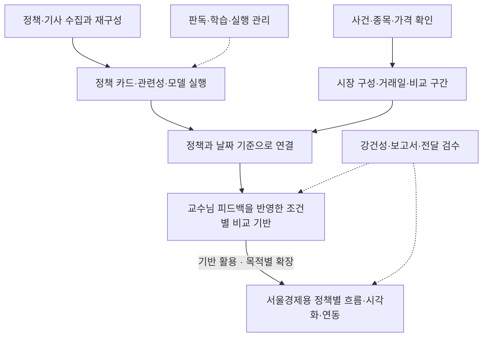
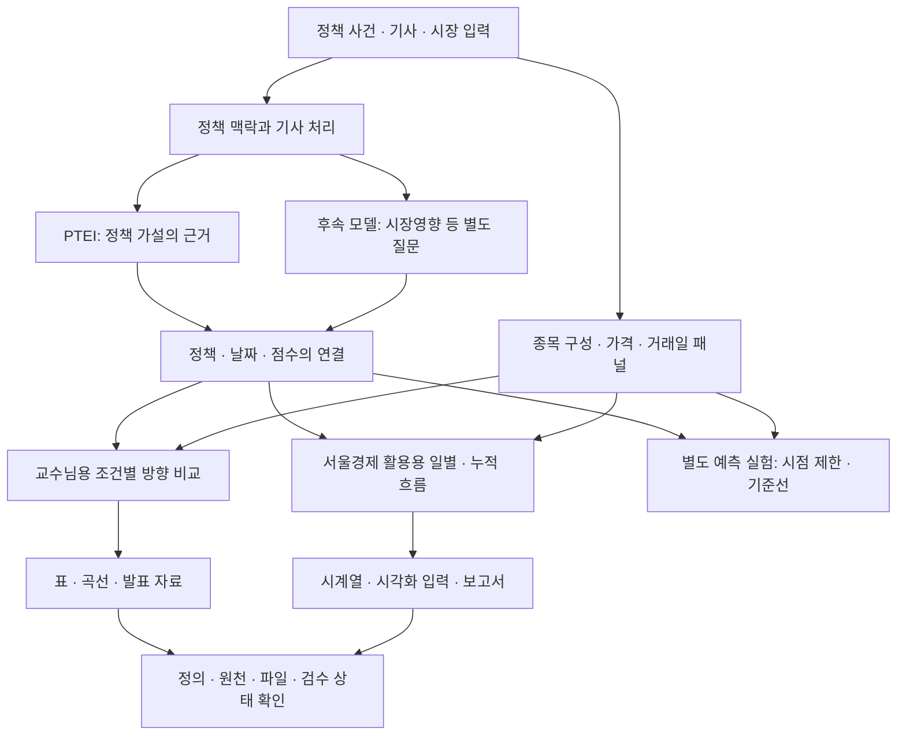

# 전체 구현 지도 — 입력에서 검수 자료까지

이 문서는 2026년 9월 회고에서 초기·후속 프로젝트의 코드와 작업 자료를 다시 대조해 정리했습니다. [시간순 개발 과정](DEVELOPMENT_JOURNEY.md)이 일이 이어진 순서라면, 여기서는 각 업무의 입력·구현·산출물·확인 범위를 읽을 수 있습니다.

초기 공개 구현에는 직접 이동할 수 있는 링크를 붙였습니다. 후속 코드의 파일명·고객 설정·원자료를 추가 공개하는 대신 확인한 처리 역할을 설명합니다. 동일 파일의 복사본, 생성한 PDF·HTML 변형, 외부 논문을 새로운 개발 기능으로 중복 계산하지 않습니다. 파일 수를 기여도나 개발 시간으로 환산하지 않습니다.

## 처리 관계를 먼저 보기

역할과 처리 관계를 그린 회고 도식입니다. 모든 작업의 시간순서나 같은 모델의 성능 향상을 나타내지 않습니다. [홈페이지의 구현 지도](https://soccz.github.io/projects/market-impact-v2/#development-atlas)에서는 각 노드에서 상세 구현으로 이동할 수 있습니다.

## 내가 담당한 작업의 범위

### 01. 사건·기준일·종목의 연결

정책 목록을 계산 가능한 입력으로 만들기.

- **입력:** 정책 사건, 대표 종목, 가격 자료
- **구현:** 정책별 기준일과 반응일을 확인하고 종목·가격 자료를 연결했습니다. 사건을 교체하거나 목록을 다시 구성하면 기존 번호가 같은 사건을 뜻하는지부터 다시 확인해야 했습니다.
- **산출물:** 검증 스크립트, 사례별 수집·자료 묶음, 사건 확인 보고서
- **확인 범위:** 처음 확인한 사건 목록을 이후 재구성한 정책 목록과 같은 데이터로 취급하지 않습니다.

공개 근거: [이벤트 검증](https://github.com/soccz/market-impact-analysis/blob/5193cbb/verify_50_events.py)

### 02. 재수집과 코퍼스 재구성

수집량·관련성·날짜 분포를 함께 확인하기.

- **입력:** 정책별 검색식, 사건 기준일, 수집 구간
- **구현:** 날짜 구간과 질의 방식을 나눠 페이지를 수집하고, 재시도·오류·조회 건수를 남기는 수집기를 구성했습니다. 중복 결합, 정책별 보강, 관련성 필터, 기준일 재정렬을 거쳐 입력을 다시 만들었습니다.
- **산출물:** 정책별 수집 파일, 질의·구간별 로그, 데이터 준비 상태표
- **확인 범위:** 기사 수가 많아도 날짜에 고르게 분포하거나 해당 정책을 직접 다룬다는 뜻은 아닙니다. 오류 기록의 존재도 수집 완결성의 보장은 아닙니다.

근거 유형: 후속 구현·작업 문서를 대조한 회고. 해당 전체 구현을 이 공개 저장소에서 재실행할 수 있다고 표시하지 않습니다.

### 03. 정책 카드·가설·관련성

모델에 넣을 질문과 통과 근거를 코드로 정의하기.

- **입력:** 정책 유형·방향·대상과 기사 제목·본문
- **구현:** 카드에서 가설을 생성하고 관련성·입장·채널 역할을 구분했습니다. 정확 일치·토큰·별칭·제외어, 종목명 적중 같은 중간 근거를 따로 남겼습니다.
- **산출물:** 비교 가설, 관련성 등급과 적중 근거, 지지·반박 출력
- **확인 범위:** 공통 템플릿에도 예외와 검토 표시가 남습니다. 설명 가능한 규칙이 표현 변형을 놓칠 수 있습니다.

공개 근거: [가설 생성](https://github.com/soccz/market-impact-analysis/blob/5193cbb/v2/code/build/build_hypotheses.py) · [공통 함수](https://github.com/soccz/market-impact-analysis/blob/5193cbb/v2/code/ptei_utils.py)

### 04. 판독·합의·재검토 도구

라벨이 갈리는 행을 다시 판단할 수 있게 만들기.

- **입력:** 복수 판독 파일, 확신도, 판단 근거
- **구현:** 입력 형식과 허용값을 검증하고, 복수 판독을 합쳐 자동 처리와 재검토 대상을 분리했습니다. 원 판독·확신도·이유를 함께 보존하는 출력과 재검토 큐를 만들었습니다.
- **산출물:** 합의 후보, 상태값, 재검토 큐, 일치도 계산과 검토용 자료
- **확인 범위:** 후보값이 채워져 있어도 사람의 최종 확인을 뜻하지 않습니다. 공통 ID만 처리하는 누락 문제와 분기 우선순위의 한계도 공개 코드에서 확인됩니다.

공개 근거: [합의와 검토 큐](https://github.com/soccz/market-impact-analysis/blob/5193cbb/v2/code/train500/build_train_500_consensus.py) · [입력 검증](https://github.com/soccz/market-impact-analysis/blob/5193cbb/v2/code/train500/validate.py)

### 05. 배치 추론과 중간 상태

전체 입력을 모델 호출과 출력 추적으로 연결하기.

- **입력:** 기사 행, 정책 카드, 채널 시드, 비교 가설
- **구현:** 관련성·키워드 판정을 먼저 수행하고, 설정에 따라 임베딩 후보를 모은 뒤 활성 채널이 있는 행을 정책별 NLI 작업으로 묶었습니다. 모델 출력을 원래 행 위치로 되돌리고 중간 판정과 함께 저장했습니다.
- **산출물:** 행별 관련성·채널 정보·입장 점수, 정책별 진행 로그, 후속 집계 입력
- **확인 범위:** 건너뛴 행에 들어간 기본 neutral과 모델이 실제 추론한 neutral은 구분해야 합니다. 배치 코드의 존재만으로 속도 향상이나 메모리 안전을 검증했다고 쓰지 않습니다.

공개 근거: [배치 추론 실행 구조](https://github.com/soccz/market-impact-analysis/blob/5193cbb/v2/code/run_ptei_full_inference_batched.py)

### 06. 학습과 여러 모델의 실행

서로 다른 모델 출력을 비교 구조에 연결하기.

- **입력:** 학습 라벨, 기사 입력, 모델별 출력과 실행 환경
- **구현:** 관련성·입장 분류 학습과 평가 루프를 만들고 후속 추론을 연결했습니다. 이후 다른 NLP 모델 실행, 번역을 거친 감성 분석, 장치 선택과 중간 저장·재개, 출력 정규화까지 작업 범위가 확장됐습니다. 모델이 만든 판독을 경량 분류기로 옮겨 전체 입력에 적용하는 실험과, 그 판독을 얼마나 재현하는지 평가하는 작업도 진행했습니다.
- **산출물:** 모델별 점수 파일, 학습·평가 결과, 중간 저장과 비교용 출력
- **확인 범위:** 모델 판독의 재현도는 사람 정답이나 시장 예측력을 검증한 값이 아닙니다. 번역 입력과 원문 입력의 의미도 같다고 보장할 수 없습니다. 과거 재개 코드는 행 수 등 제한된 조건에 의존하므로 입력 해시까지 확인하는 완전한 복구 체계라고 부르지 않습니다.

공개 근거: [학습·평가 루프](https://github.com/soccz/market-impact-analysis/blob/5193cbb/v2/code/finetune/finetune_klue_roberta.py) · [후속 추론](https://github.com/soccz/market-impact-analysis/blob/5193cbb/v2/code/finetune/run_ptei_full_inference_v2.py)

### 07. 종목 구성과 시장 패널

사건 시점의 구성·가중치·가용 종목을 추적하기.

- **입력:** 가격·상장 정보·시가총액·산업 분류
- **구현:** 정책 시점의 가용 정보를 기준으로 시장·규모별 종목 묶음을 만들고 구성 종목과 기준 가중치를 출력했습니다. 일별 가용 종목에 맞춘 가중치 재정규화와 별도 재계산 점검도 구현했습니다.
- **산출물:** 구성 종목표, 기준 가중치, 일별 수익률·지수와 가용 종목 수
- **확인 범위:** 가중치 합이 맞아도 원천 가격이 올바르다는 뜻은 아닙니다. 결측 제거 뒤 서로 떨어진 가격을 연결하는 문제와 원천 버전은 별도 점검 대상입니다.

근거 유형: 후속 구현·작업 문서를 대조한 회고. 해당 전체 구현을 이 공개 저장소에서 재실행할 수 있다고 표시하지 않습니다.

### 08. 날짜·분모·모델 커버리지

비교 가능한 관측치를 만들고 빠진 표본을 설명하기.

- **입력:** 뉴스 날짜·점수, 거래일 가격, 모델별 가용 범위
- **구현:** 기사별·일별 입력을 정책과 날짜에 맞춰 구성하고 전방 수익률과 연결했습니다. 교수님 피드백을 반영해 정책별 비율을 먼저 구한 뒤 같은 비중으로 평균하고 조건별 비교표를 생성했습니다.
- **산출물:** 뉴스–수익률 쌍, 정책별 결과, 시장·규모·기간별 표와 커버리지
- **확인 범위:** 코드 버전마다 같은 날과 다음 거래일 기준이 다릅니다. 점수가 높은 모델이라도 적용 정책과 날짜가 다르면 같은 표본에서의 우위를 의미하지 않습니다.

근거 유형: 후속 구현·작업 문서를 대조한 회고. 해당 전체 구현을 이 공개 저장소에서 재실행할 수 있다고 표시하지 않습니다.

### 09. 강건성·선택·시간구조 점검

좋아 보이는 결과가 어떤 조건에서 유지되는지 확인하기.

- **입력:** 탐색 규칙, 정책별 신호·시장 자료, 비교 설정
- **구현:** 대안 정의, 기간·시차, 정책 간 교차배정, 순열·부트스트랩, 시간구조와 선택 자유도의 영향을 살피는 검토 코드를 구성했습니다. 탐색 결과와 별도 검증 결과를 나눠 읽는 자료를 만들었습니다.
- **산출물:** 대안별 비교, 홀드아웃 검토, 위약·민감도와 시간구조 진단
- **확인 범위:** 검정 코드를 작성·실행했다는 사실이 가설의 통과나 인과 확인을 뜻하지 않습니다. 원천이나 선택 규칙이 달라지면 이전 수치도 다시 확인해야 합니다.

근거 유형: 후속 구현·작업 문서를 대조한 회고. 해당 전체 구현을 이 공개 저장소에서 재실행할 수 있다고 표시하지 않습니다.

### 10. 별도 예측 실험과 기준선

동행 분석 이후 예측 질문을 별도 사양으로 실험하기.

- **입력:** 관측 마감시점까지의 뉴스·시장 정보, 이후 결과
- **구현:** 입력과 정답의 시점을 분리하고 시간순 평가, 단순 기준선, 신뢰도별 적용률을 비교하는 별도 실험을 구성했습니다. 사용 피처와 미래정보 차단 조건, 새 입력 형식과 실행 기록을 남기는 코드가 있습니다.
- **산출물:** 실험 사양, 평가·기준선 비교, 적용률과 실행 명세
- **확인 범위:** 기존 동행 결과를 예측 성과로 승격한 것이 아닙니다. 기록의 결과는 성공 기준 미충족으로 읽으며, 9월 개인 연구 프로토타입과도 별개입니다. 상세 사양과 수치는 여기서 공개하지 않습니다.

근거 유형: 후속 구현·작업 문서를 대조한 회고. 해당 전체 구현을 이 공개 저장소에서 재실행할 수 있다고 표시하지 않습니다.

### 11. 차트·발표·보고서 생성

다시 계산한 결과를 전달 형식으로 조립하기.

- **입력:** 정책별·조건별 결과표, 시계열, 그림
- **구현:** 분석 결과를 시각화하고 발표 HTML과 PDF, 문서형 보고서로 구성하는 생성기를 만들었습니다. 표 분할, 모델별 구획, 용어 통일, 축과 설명, 인쇄 레이아웃을 반복 조정하는 작업도 포함됩니다.
- **산출물:** 정책별 그래프, 조건별 비교표, 발표 자료와 보고서
- **확인 범위:** 문서가 정상 렌더링돼도 원천 수치가 검증되는 것은 아닙니다. 과거 일부 생성·검증 코드에 고정 기대값이 남으므로 원천 갱신 때 함께 점검해야 합니다.

공개 근거: [초기 시각화 생성 코드](https://github.com/soccz/market-impact-analysis/blob/5193cbb/v2/code/make_figures_part4.py)

### 12. 연동 자료와 전달 검수

다른 사람이 같은 정의로 읽고 사용할 수 있게 만들기.

- **입력:** 분석 표·시계열, 표시명, 버전과 전달 대상
- **구현:** CSV·JSON과 시각화용 데이터 설명을 준비하고, 표시 문구를 바꾼 사본과 수치 필드의 일치 여부를 따로 확인하는 생성·검증 코드를 구성했습니다. 파일 목록·해시·패키지 검사와 판독 질문의 차이를 설명하는 자료도 정리했습니다.
- **산출물:** 연동용 데이터, 필드 설명, 검토 사본, 파일 목록과 검수 자료
- **확인 범위:** 패키지 무결성, 분석 원천 정확성, 사람 판독 확인, 외부 인수는 서로 다른 상태입니다. 내부 보완 필요 기록을 공식 완료로 바꾸어 서술하지 않습니다.

근거 유형: 후속 구현·작업 문서를 대조한 회고. 해당 전체 구현을 이 공개 저장소에서 재실행할 수 있다고 표시하지 않습니다.

## 기반을 재사용한 부분과 질문이 갈라진 부분

화살표는 처리 기반의 연결을 나타냅니다. 모든 분기가 같은 기사·점수·표본을 사용하거나 성능이 순차적으로 개선됐다는 뜻은 아닙니다. 교수님 피드백을 반영한 분석 기반을 활용 목적에 맞게 확장하면서도, 비교 질문과 출력 단위는 따로 정의해야 했습니다.

## 판단·요구·구현을 구분한 기여 기록

| 기록에서 확인한 주체와 단계 | 내 작업으로 설명하는 범위 | 확인 근거 |
|---|---|---|
| 초기 일지에 본인 문제 제기로 남은 판단 | 채널·신규성의 중복 반영 검토, 사례별 문장 수정의 위험, 디버깅과 평가 구분을 구현 원칙으로 정리 | 초기 REPORT Part 4와 공개 함수·실험 코드 |
| 교수님·연구실의 피드백 | 비교 시점·분모·정책별 평균·포트폴리오 조건을 계산과 발표 자료에 반영 | 후속 회의 기록과 비교·발표 생성 코드 |
| 서울경제의 활용 요구 | 연구 처리 기반에서 정책별 흐름·시각화 입력·설명 자료를 구성 | 후속 흐름 계산·보고·연동 자료 |
| 나의 구현과 실행 점검 | 수집, 입력 연결, 라벨 도구, 모델 실행, 집계·비교, 산출물 생성과 검토 코드 | 각 업무 항목의 공개 구현 또는 후속 자료 |
| 9월 회고에서 새로 정리한 설명 | 합성 예제, 코드 읽기, 현재 시점의 한계 정리와 개인 연구 질문 | 이번 문서·예제 커밋 |

기존 모델과 라이브러리, AI 보조 작업을 활용했습니다. 모델 자체의 개발·모든 연구 아이디어의 독창성·기사와 공개 서비스 전체의 제작을 본인 기여로 합치지 않습니다. [실제로 동작을 확인하는 구현 사례](ENGINEERING_CASES.md)에서 라벨 처리 원본을 재실행하고, 날짜와 커버리지의 차이를 작은 합성 입력으로 살펴볼 수 있습니다.
