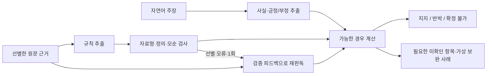

# 한국어 복합 정책 조건을 읽고, 모르는 정보를 남기는 방법

정책·기사·시장 데이터를 연결한 기존 개발에서 출발해, 개인 후속 연구의 질문을 **“한국어 문장이 어떤 사실을 말하며, 어떤 조건에서 결론이 바뀌는가”**로 좁혀 왔다. 앞선 [정정 후 선택적 갱신](../policy_selective_update/)에서 날짜별 한도를 구조로 추출해 실행했지만 신청자 정보는 사람이 미리 정리했다. 이번에는 **자연어 신청자 정보 추출까지 모델에 맡기고**, 동시에 충족할 조건·선택 가능한 조건·제외의 예외·금액 환산을 비교했다.

이 디렉터리는 2026-10-01 실행한 개인 후속 연구다. 과거 서울경제 제공물의 성과로 소급하지 않는다. AI 지원으로 작성한 실험·잠정 주석이며 새 모델 학습 0회, 독립 사람 검수 0명이다.

[전체 결과·실패](RESULTS.md) · [주석과 출처 한계](ANNOTATION.md) · [실험 규약](protocol.json) · [시각 연구 노트](https://soccz.github.io/projects/market-impact-research/#compositional-reasoning)

## 이번에 구현하고 확인한 것

1. 원문에서 규칙을, 주장에서는 신청자 사실과 긍정·부정을 **분리 추출**한다. 규칙 추출에 질문을 주지 않고 사실 추출에 원문을 주지 않는다.
2. 추출한 AND/OR 조건을 검증하고, 미확인 값의 가능한 경우를 계산한다. 같은 나이가 여러 조건에 나와도 서로 다른 미지수처럼 취급하지 않는다.
3. 규칙만 또는 신청자 정보만 잠정 참조값으로 바꾸어 오류가 어디서 생겼는지 진단한다. 이 대체 점수를 실제 모델 성능으로 보고하지 않는다.
4. 선형 환산식과 학적 예외를 추가하고, 모델이 정의하지 않은 계산 변수와 항상 참/거짓인 규칙을 검출해 **정답 없이 한 차례 재판독**했다.
5. 최종 답은 맞아도 신청자 사실을 잘못 읽은 경우를 [별도 감사](results/fact_audit.json)한다. Qwen 환산의 8/8 중 사실까지 일치한 것은 7/8이었다.
6. 추출된 규칙 안에서 결론에 충분한 최소 개수의 관측 사실, 결론을 바꿀 수 있는 미확인 항목, 통과·미통과의 가상 보완 사례를 계산했다. 설명이 원문을 충실히 읽었다는 보증은 아니다.



## 자료·시점·비교 범위

| 자료 | 주장 | 역할 |
|---|---:|---|
| 작성한 개발 규정 8묶음 | 24 | 최초 실패 관찰, 지시문 보완 |
| 새 문서 2개에서 선별한 8범위 | 32 | 지시문 고정 뒤 새 자료 첫 적용 |
| 새로 작성한 조건 조합 8묶음 | 32 | AND/OR·예외·누락 정보의 구성적 진단 |
| 같은 두 문서의 복잡한 2범위 | 16 | 환산식·학력 예외의 사후 표현 확장 |

총 104개 작성 주장이다. 모델·방법을 바꾼 반복을 독립 정책 사건으로 세지 않는다. 저장 응답은 626개이며 재사용을 포함한 공개 레코드 1,404개와 다르다. 개발 실행이 중단·재개되어 전송 후 미저장 요청의 수는 알 수 없다. [호출 집계](results/accounting.json)

새 자료는 대전 2025-1493 PDF 8쪽과 광주 2025-194 명의 HWPX 사본 298개 비어 있지 않은 문단이다. 대전 파일은 공식 운영 도메인의 인증서 만료로 TLS 검증 없이 받은 공개 PDF다. 광주 파일은 공개 배포처 첨부이며 공식 서버의 HTTP 400 때문에 원본과 바이트 대조하지 못했다. 두 파일의 고정 해시와 재다운로드 일치만 확인했으며 출처 인증까지 입증한 것이 아니다. 전체 문서 자동 자격 판정이 아니라 **수동 선택 범위의 언어 판독**이다.

개발 초반 결과를 보고 지시문을 명확히 한 뒤 새 문서 수집 전에 `method_freeze.json`을 남겼다. 이후 논리 예시 추가는 문서를 수집한 뒤의 변경이다. 구성 실험은 그 예시를 고정한 뒤 작성했지만 같은 작성자의 합성 진단이다. 환산식·학력 확장과 자동 재판독은 결과를 본 뒤의 탐색이다. 각 후속 실행 전에 별도 파일 해시·시각을 기록했으며, 이는 로컬 기록으로 제3자 사전등록이 아니다.

## 실행 방식과 비교의 한계

기본 표현은 23개 공통 필드, OR로 연결된 AND 묶음(DNF), 엄격한 자료형이다. 값이 없는 항목을 거짓으로 채우지 않는다. 유한 구간 분할은 최대 4,096개 경우를 탐색하고 그 이상은 보수적으로 확정하지 않는다. 선형식 확장에는 학적 필드 4개를 추가하고 Z3의 유리수 연산을 사용한다. 모델이 생성한 임의 코드는 실행하지 않는다. 해석기는 추출 구조를 계산할 뿐 원문의 의미를 인증하지 않는다.

Qwen3.5:9b와 공개 배포본 계보를 확인한 Kanana 양자화본을 비교했다. [이전 계보 기록](../policy_scope_reading/models.json), [고정 모델 식별자](models.json). 온도 0, seed 20261001, 문맥 8192, Qwen thinking 비활성. 기본 출력 한도는 규칙 1536·사실 512·직접 판독 256이다. 표현 확장은 규칙 한도를 3072로 함께 늘렸다. 따라서 표현력만의 효과를 분리한 실험이 아니다. 반복 seed 분산이나 생산 환경 지연을 추정하지 않았다.

규칙을 묶음별 1회, 사실을 주장별 1회 읽으면 새 문서 32개에서 모델당 40회가 필요하다. 직접 판독은 32회다. 계산 단계는 추가 LLM 호출을 쓰지 않지만 이 구성의 호출 비용이 더 작다고 주장하지 않는다.

## 재현

Python 3.12.9로 실행했다. 공개 레코드만으로 점수·오류·설명을 다시 계산할 수 있다.

```bash
python3 -m venv .venv
.venv/bin/pip install -r research/policy_compositional_reasoning/requirements.txt
.venv/bin/python research/policy_compositional_reasoning/verify.py
.venv/bin/python research/policy_compositional_reasoning/diagnostics.py
.venv/bin/python research/policy_compositional_reasoning/plot.py
```

원문을 다시 받아 입력을 만들려면 다음을 실행한다. 다운로드는 `sources.json`의 TLS 제한을 그대로 사용하며 파일이 교체되면 해시 검사에서 중단한다. 원문과 입력은 공개 저장소 밖에 둔다.

```bash
python research/policy_compositional_reasoning/prepare_inputs.py --download --sources ../private/sources --out ../private/official_inputs.json
python research/policy_compositional_reasoning/prepare_inputs.py --sources ../private/sources --reference research/policy_compositional_reasoning/capability_reference.json --out ../private/capability_inputs.json
```

각 runner의 `--help`와 [재현 실행표](REPRODUCE.md)를 따른다. 재실행 결과가 같은 바이트일 것이라고 가정하지 않는다. 공개 검증은 보존한 최초 응답을 재채점한다. 원시 응답 캐시가 있는 로컬 환경의 `verify.py --cache CACHE`는 입력·요청·모델·응답 해시, 시각, 36개 보고서의 바이트 재생성까지 추가 검사한다. 원시 응답과 원문 전체는 배포하지 않는다.

## 관련 연구와 개인 연구의 위치

[Logic-LM (EMNLP Findings 2023)](https://aclanthology.org/2023.findings-emnlp.248/)은 언어모델의 형식화와 기호 추론, 도구 피드백을 결합한 선행연구다. 이 결합 자체를 새 발명으로 주장하지 않는다. [CLUTRR (EMNLP 2019)](https://aclanthology.org/D19-1458/)의 구성적 추론 문제의식과 연결되지만 본 연구는 그 벤치마크를 사용하거나 성능을 비교한 것이 아니다. [Z3](https://github.com/Z3Prover/z3)는 추출한 제약의 계산에 사용했다.

현재의 기여는 한국어 정책에서 **주체·부정·제외 예외·누락 정보·단위 환산이 서로 다른 오류를 만드는 과정**을 버전·원문 위치·입출력 해시·실패 사례와 연결한 재현 가능한 소규모 사례 연구다. 독립 주석 검증과 폭넓은 기관 일반화, 실제 검토자의 시간 절감은 아직 입증하지 않았다. [빈 독립 검토 양식](human_review.csv)에 자동으로 사람의 판단을 채우지 않았다.
