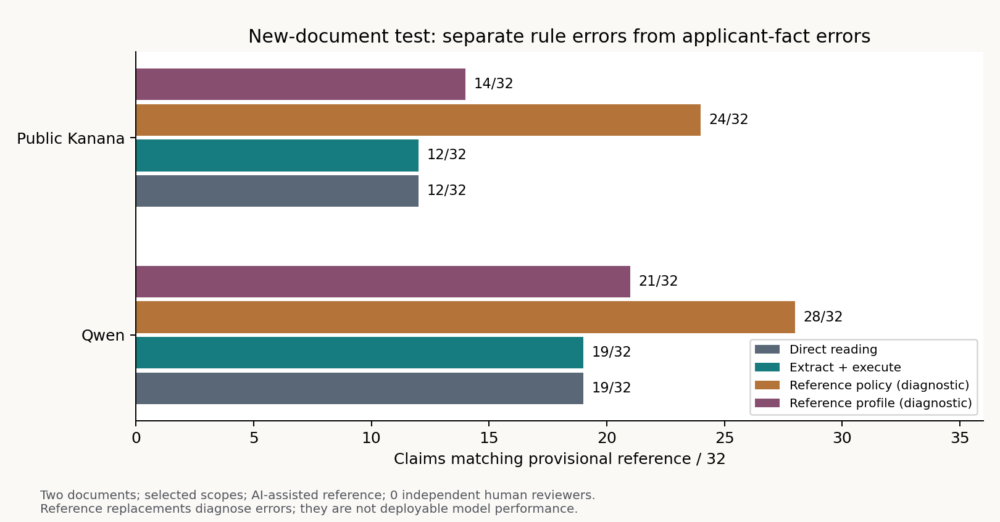
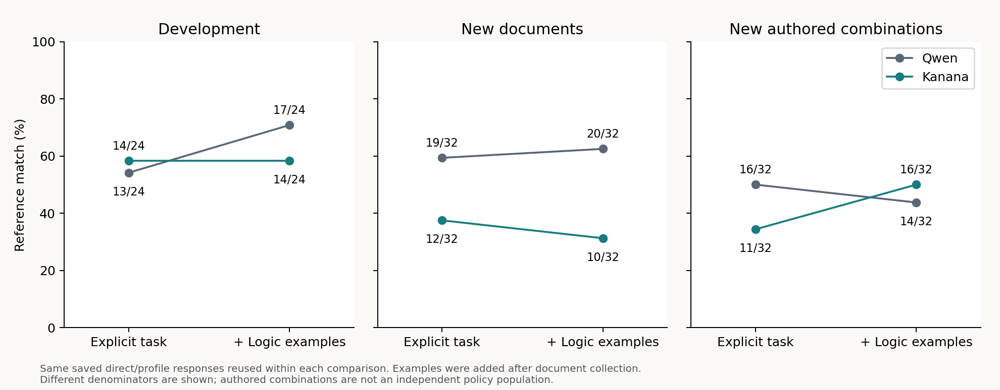
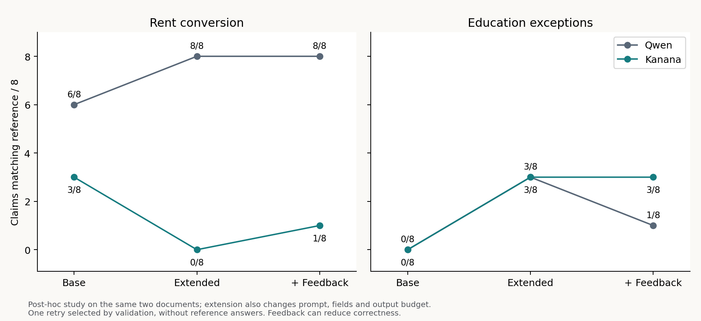

# 결과: 계산은 정확해져도 잘못 읽은 규칙은 남는다

새 문서 첫 적용 32개에서 직접 판독과 구조 추출·실행의 정답 수는 Qwen 19/32, Kanana 12/32로 각각 같았다. 모델이 규칙을 정확히 읽었다고 결론 낼 수 없다. 같은 두 문서의 사후 실험에서는 Qwen의 임대료 환산이 6/8→8/8로 개선됐지만 학력 예외는 3/8에 그쳤고 자동 재판독 후 1/8로 낮아졌다.

모든 수치는 AI 지원 잠정 기준에 대한 일치 수다. 두 문서 계열, 공유 규칙, 반복 비교를 독립 표본으로 가정하지 않으며 유의성·신뢰구간·전체 평균으로 일반화하지 않는다.

## 최초·후속 결과를 함께 보존

| 조건 | 주장 수 | Qwen 직접 | 추출·실행 | Kanana 직접 | 추출·실행 |
|---|---:|---:|---:|---:|---:|
| 개발 최초 | 24 | 19 | 4 | 15 | 8 |
| 개발 지시 명확화 | 24 | 19 | 13 | 15 | 14 |
| 개발 논리 예시 | 24 | 19 | 17 | 15 | 14 |
| 새 문서 첫 적용 | 32 | 19 | 19 | 12 | 12 |
| 새 문서 논리 예시 | 32 | 19 | 20 | 12 | 10 |
| 새 문서 검증 피드백 | 32 | 19 | 19 | 12 | 13 |
| 작성 조합 기본 | 32 | 12 | 16 | 13 | 11 |
| 작성 조합 논리 예시 | 32 | 12 | 14 | 13 | 16 |
| 작성 조합 검증 피드백 | 32 | 12 | 16 | 13 | 14 |
| 동일 문서 확장 전 | 16 | 11 | 6 | 6 | 3 |
| 동일 문서 표현 확장 | 16 | 11 | 11 | 6 | 3 |
| 동일 문서 검증 피드백 | 16 | 11 | 9 | 6 | 4 |

직접 판독은 동일 주장·입력에서 재사용한다. 기본→예시→피드백이 모두 순차 누적된 것은 아니다. 새 문서·작성 조합의 피드백은 지시 명확화 방법에 적용했고, 복잡한 16개는 표현 확장에 적용했다. 세 단계의 좋은 결과만 합친 최적 선택 점수는 없다.

## 어떤 단계가 병목인가

| 새 문서 32개 | 실제 추출·실행 | 규칙만 참조로 교체 | 사실만 참조로 교체 | 사실 전체 일치 | 규칙 동등 / 8 |
|---|---:|---:|---:|---:|---:|
| Qwen | 19 | 28 | 21 | 28/32 | 4/8 |
| Kanana | 12 | 24 | 14 | 20/32 | 1/8 |

참조 교체는 오류 진단이다. 두 단계를 모두 참조로 넣어 32/32가 되는 것은 작성한 평가와 해석기의 일관성을 확인할 뿐 실제 성능 증명이 아니다. 규칙 하나가 여러 주장을 공유하므로 주장 수준 개선 수와 독립 규칙 성공 수를 함께 본다.

## 예시를 더 주면 다른 조건에서도 나아지는가

개발 지시 명확화 뒤 논리 예시를 넣으면 Qwen은 13→17/24, Kanana는 14→14/24였다. 새 문서에서는 각각 19→20/32, 12→10/32, 새 작성 조합에서는 16→14/32, 11→16/32였다. 개발셋의 개선을 일반적 개선으로 확대하지 않는다. 새 작성 조합은 일부 항진식·모순 진단을 의도적으로 포함한다. 자연 발생 정책의 대표 표본이 아니다.

## 미확인 값의 상관관계

“가입일은 모르지만 어느 날짜 구간에서도 이 보증금은 상한 이하”라면 날짜를 몰라도 통과할 수 있다. 단순 3값 논리는 각 원자를 따로 미확인으로 처리해 이를 놓친다. 유한 구간 분할은 같은 미확인 변수의 상관관계를 보존한다. 작성 조합의 Qwen은 13→16/32로 3개를 복구했다. Kanana는 11→11/32로 맞춘 것과 잃은 것이 있었다. 잘못 추출한 조건도 더 단정적으로 계산할 수 있다.

## 금액 환산과 학력 예외: 표현 확장의 성공과 실패

| 범위 / 모델 | 직접 | 확장 전 | 표현 확장 | 검증 피드백 |
|---|---:|---:|---:|---:|
| 임대료 환산 / Qwen | 6/8 | 6/8 | 8/8 | 8/8 |
| 임대료 환산 / Kanana | 3/8 | 3/8 | 0/8 | 1/8 |
| 학력 예외 / Qwen | 5/8 | 0/8 | 3/8 | 1/8 |
| 학력 예외 / Kanana | 3/8 | 0/8 | 3/8 | 3/8 |

Qwen은 원문 환산식을 `월세 + 보증금 × 0.05 / 12`로 추출했다. 2,400만원·70만원이면 80만원, 보증금을 240원 올리면 환산액이 1원 초과하는 경계를 정확한 유리수로 계산했다. 최종 판단은 8/8이지만 신청자 사실까지 일치한 것은 7/8이다. `cap-rent-4`의 보증금 24,000,240원을 24,002,400원으로 오독해 환산액도 800,001원 대신 800,010원이 됐다. 모두 상한 초과여서 답만 맞았다. [사실 오류 감사](results/fact_audit.json)는 이런 최종 정답 뒤에 가려진 오류를 모든 조건에서 따로 집계한다. 이 분석은 화면의 세부 추적을 검토한 뒤 추가한 사후 진단이며 새 추론은 아니다. 선택 범위 1개·동일 자료의 사후 실험이다.

학력 예외에서 Qwen은 일반·원격·학점은행제 및 이전 졸업 여부의 상반된 조건들을 하나의 AND 묶음에 넣어 항상 거짓인 규칙을 만들었다. Kanana 환산식은 정의되지 않은 `derived_0`를 참조해 8개 모두 형식 보류됐다. 검증 피드백은 이 문제를 감지해도 원문 의미를 고치는 데 충분하지 않았다.

표현 확장은 필드·프롬프트·계산기·출력 예산이 함께 바뀐 비교다. 특정 한 요소의 효과로 단정하지 않는다.

## 정답을 주지 않는 자동 재판독

36개 규칙 출력에서 형식 무효 또는 전체 도메인에서 항상 참/거짓인 10개를 선별해 한 번씩 재판독했다. 원문·범위·기존 출력·검증 피드백만 주고 주장·잠정 참조 정답은 주지 않았다. 항상 거짓인 정책이 실제로 존재할 수 있으므로 무조건 참을 만들도록 요구하지 않았다. 선택과 요청은 `repair_selection.json`, `repair_freeze.json`, `test_repair.py`로 추적한다.

Qwen 새 문서 19→19/32, 작성 조합 16→16/32, 복잡한 범위 11→9/16. Kanana는 12→13/32, 11→14/32, 3→4/16이었다. 재판독을 무조건 성공 처리하지 않는다.

## 확신·설명·비용을 따로 보기

직접 판독과 추출·실행이 같은 지지/반박을 내는 경우만 채택해도 새 문서에서 Qwen은 9/32개 채택 중 1개 오답, Kanana는 9개 중 4개 오답이었다. 작성 조합은 Qwen 5개 중 3개, Kanana 11개 중 6개 오답이었다. 같은 오해에 합의할 수 있어 합의만으로 안전한 확정을 보장하지 않는다.

`explain.py`는 기본 구조에 대해 결론을 유지하는 최소 개수의 관측 사실 묶음, 판정을 바꿀 수 있는 미확인 필드, 통과·미통과의 가상 보완 사례를 추가 호출 없이 계산한다. 이는 추출 규칙 안의 설명이며 원문 충실성·최적 질문 순서·실제 검토 시간 절감의 검증이 아니다. 선형식 확장 사례에는 이 설명 분석을 적용하지 않았다.

원문 전문·원시 자유서술은 비공개이며 구조화 출력·해시·시각·모델 digest를 공개한다. 저장 응답 626개, 재사용 포함 레코드 1,404개. API의 보고 토큰 수를 숨은 추론까지 포함한 전체 토큰으로 해석하지 않는다.

## 검증된 범위

`verify.py --cache CACHE`는 33개 행동 테스트, 6,237개 논리 완성 경우, 36개 금액 경계 조합, 7개 동결 기록, 앞 연구 2,146개 산출물의 불변성, 24개 모델·조건의 재채점, 1,404개 캐시 레코드 대조와 36개 보고서 바이트 재생성을 검사한다. 공개-only 실행은 원시 캐시 대조와 원문 재생성을 제외한 검사를 수행한다.

성능 주장의 다음 근거는 독립 사람 주석과 다른 출처·서식·예외 구조의 외부 검증이어야 한다. 현재 점수에 맞춘 추가 수정이나 같은 자료의 실행 횟수 증가가 이를 대신하지 않는다.
