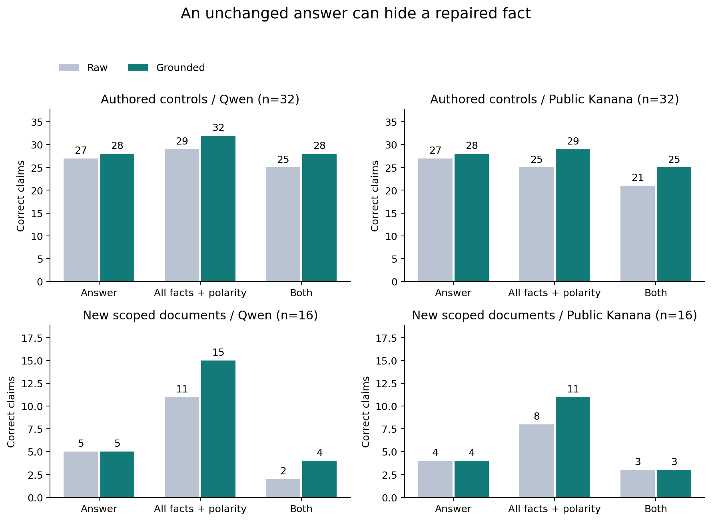
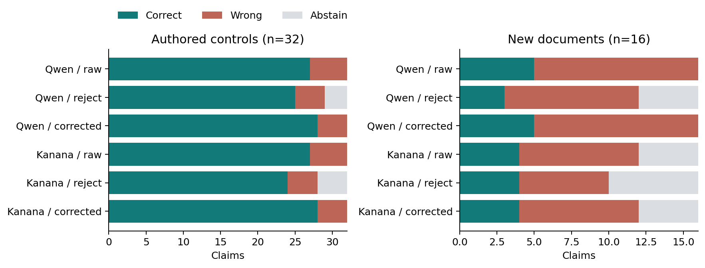
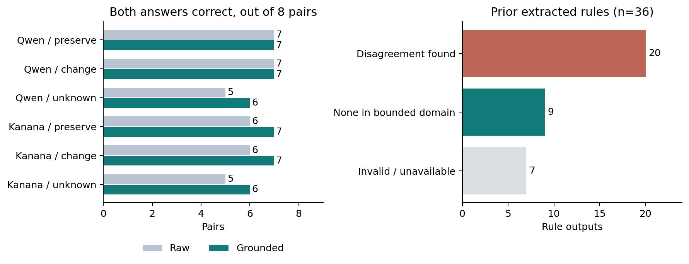

# 실제 결과와 해석

공개 모델 2개, 새 48작성 주장, 새 저장 응답 216개. 아래 모든 값은 AI 지원 잠정 참조와의 일치 수다. 독립 사람 주석 0명이며 작성 변형과 동일 규칙 공유 사례를 독립 표본으로 간주하지 않는다.

## 답·사실·동시 일치

### 작성 표현·의미 대조 32개

| 모델 | 직접 답 | 추출+실행 답 | 보정 후 답 | 사실 전체 전→후 | 답+사실 전→후 | 검사 포함 | 불일치 발견 | 보류 경로 정답 / 보류 |
|---|---:|---:|---:|---:|---:|---:|---:|---:|
| Qwen | 25/32 | 27/32 | 28/32 | 29→32/32 | 25→28/32 | 12/32 | 3 | 25 / 3 |
| 공개 Kanana | 13/32 | 27/32 | 28/32 | 25→29/32 | 21→25/32 | 12/32 | 4 | 24 / 4 |

- Qwen: 답 복구 1·훼손 0, 사실 복구 3·훼손 0. 참조 규칙 교체 진단 32/32.
- Kanana: 답 복구 1·훼손 0, 사실 복구 4·훼손 0. 참조 규칙 교체 진단 32/32.
### 방법 고정 후 새 문서 16개

| 모델 | 직접 답 | 추출+실행 답 | 보정 후 답 | 사실 전체 전→후 | 답+사실 전→후 | 검사 포함 | 불일치 발견 | 보류 경로 정답 / 보류 |
|---|---:|---:|---:|---:|---:|---:|---:|---:|
| Qwen | 12/16 | 5/16 | 5/16 | 11→15/16 | 2→4/16 | 8/16 | 4 | 3 / 4 |
| 공개 Kanana | 7/16 | 4/16 | 4/16 | 8→11/16 | 3→3/16 | 8/16 | 3 | 4 / 6 |

- Qwen: 답 복구 0·훼손 0, 사실 복구 4·훼손 0. 참조 규칙 교체 진단 15/16.
- Kanana: 답 복구 0·훼손 0, 사실 복구 3·훼손 0. 참조 규칙 교체 진단 13/16.

사실 전체 일치는 추출한 값과 주장 방향이 잠정 참조 전체와 맞는지를 본다. 검사 포함은 금액 필드 한 개 이상을 대조했다는 뜻이며 모든 사실을 검증했다는 뜻이 아니다. 훼손 0은 이 소규모 작성 표본에서 관찰한 수이며 향후 무해성 보장이 아니다. 보류 경로는 불일치가 있는 맞는 답도 포기하므로, 보정과 별도로 정답·보류를 동시에 보인다.

## 같은 뜻에는 안정적이고, 뜻이 바뀌면 달라지는가

기본-변형 쌍은 유형별 8개, 모델별 24개다. 아래는 두 답이 모두 맞는 쌍의 수이며 ‘같은 오답 두 개’를 성공으로 세지 않는다.

| 모델 | 변화 유형 | 직접 판독 | 추출+실행 | 금액 보정 |
|---|---|---:|---:|---:|
| Qwen | 표기·표현 유지 | 5/8 | 7/8 | 7/8 |
| Qwen | 내용·경계·극성 변경 | 4/8 | 7/8 | 7/8 |
| Qwen | 사실 누락·주체 차이 | 6/8 | 5/8 | 6/8 |
| Kanana | 표기·표현 유지 | 4/8 | 6/8 | 7/8 |
| Kanana | 내용·경계·극성 변경 | 0/8 | 6/8 | 7/8 |
| Kanana | 사실 누락·주체 차이 | 1/8 | 5/8 | 6/8 |

별도의 규정 변화 두 쌍에서는 **AND/OR 차이를 두 모델의 추출+실행이 모두 놓쳤다**. 이하/미만 쌍은 두 모델 모두 두 답을 맞혔다. 신청자 금액 검증만으로 정책의 논리 연결을 복구할 수 없다는 구체적인 실패다. Qwen 직접 판독은 AND/OR 쌍을 맞혔고 이하/미만 쌍에서는 답이 바뀌어도 둘 다 맞지는 않았다. 관계의 변화 자체와 정답을 구분해야 한다.

## 새 문서 범위별 첫 결과

| 범위 | Qwen 추출→보정 | Kanana 추출→보정 |
|---|---:|---:|
| yangsan-housing | 1→1/4 | 1→1/4 |
| yangsan-income | 1→1/4 | 2→2/4 |
| yongin-conversion | 1→1/4 | 0→0/4 |
| yongin-income-benefits | 2→2/4 | 1→1/4 |

새 문서에서는 **직접 판독 Qwen 12/16·Kanana 7/16보다 추출+실행 5/16·4/16이 낮았다**. 사실 보정이 최종 답 개선으로 이어지지 않았으므로 이 방법의 종합 성능 우월성을 주장할 수 없다. 저장된 정책 구조에서 확인한 실패는 다음과 같다.

| 범위 | Qwen 규칙 출력의 문제 | Kanana 규칙 출력의 문제 |
|---|---|---|
| 양산 금액 | 보증금·월세를 모두 0으로 요구 | 1억원을 1천만원으로 읽고 두 상한을 OR로 연결 |
| 양산 소득 | 미취업·근로·자영업을 동시에 요구하는 불가능 조건 추가 | 하한을 포함으로 바꾸고 두 구간을 OR로 연결 |
| 용인 환산 | 6.4%를 6.4로 사용, 불필요한 금액 0 조건도 추가 | 정의 없는 계산 변수로 4개 모두 보류 |
| 용인 소득·급여 | 4종 급여 제외 누락 | 소득 조건과 모든 급여 수급을 대안 경로로 연결 |

이 오류는 신청자 금액만 검증하는 방식의 범위 밖이다. 전체 참조 규칙 교체 진단 15/16·13/16은 오류 위치를 보여주며 자동 개선 성능이 아니다.

첫 16개 결과를 본 뒤 금액 검증기·모델 프롬프트·참조를 바꾸지 않았다. 공식 HWP의 선택 조항만 입력했고 전체 문서 검색·표 이미지 이해는 평가하지 않았다. 새로운 기관 자료지만 수동 범위·작성 주장·잠정 정답에 의존하므로 기관 일반화의 입증으로 부르지 않는다.

## 이전 자료 재채점과 가려진 오류

- 이전 공식 32개: qwen 사실 28→28, 답 19→19, kanana-public 사실 20→20, 답 12→12.
- 이전 작성 조합 32개: qwen 사실 28→28, 답 16→16, kanana-public 사실 26→27, 답 11→11.
- 이전 확장 16개: qwen 사실 11→12, 답 11→11, kanana-public 사실 4→9, 답 3→3.

앞선 Qwen 환산 오류는 보증금 24,002,400→24,000,240으로 복구했지만, 둘 다 조건 상한을 넘기므로 답은 그대로다. Kanana의 사실이 고쳐져도 규칙 형식 실패가 남으면 최종 답은 복구되지 않는다. 기존 자료는 방법 개발에 쓰였고 위 점수는 사후 분석이다. 전체 이전 626응답 중 선택한 세 조건만 재사용했으며 626개를 새로 추론한 것이 아니다.

## 자동 반례와 독립 계산 감사

이전 36규칙 출력 중 **반례 20개, 제한 도메인에서 반례 없음 9개, 형식 등의 문제로 비교 불가 7개**다. 20개 모두 Z3 기반 해석기와 별도 Python/Fraction 계산으로 반대 결론을 재현했다. 도메인 밖 실수·날짜·문자열의 동치성 및 참조의 원문 충실성을 보장하지 않는다. 양산 문서 내부의 자격·제외 연결 차이는 소스 불확실성으로 기록했고 전체 수급 판정 정답으로 만들지 않았다.

기존 counterexamples.json의 한글 문자열은 Z3 이스케이프로 저장된 항목이 있다. 후속 감사에서 Unicode로 복원하고 도메인 소속·독립 계산을 확인한 counterexamples_audited.json을 표시용으로 쓴다. 최초 증거는 덮어쓰지 않았다. 이는 응답을 다시 추론하거나 참조를 바꾼 보완이 아니다.

## 결과가 바꾼 연구 방향

이제 판독 결과를 답 하나가 아니라 **원문 위치 → 읽은 사실 → 적용한 규칙 → 결론**으로 기록해야 한다. 금액 검산은 사실 오류 일부를 줄였지만 정책 연결 오류를 해결하지 못했다. 규칙 차이의 자동 반례를 사람 검토 후보로 제시하고, 검토자가 원문과 대조하여 실제 수정 여부를 판단하는 구조가 다음 연결점이다. 이번에 반례 생성과 독립 계산은 실행했고, 독립 사람의 주석 일치도·검토 시간 절감은 아직 실험하지 않았다. 학술적 신규성이나 운영 성능을 입증했다고 주장하지 않는다.
