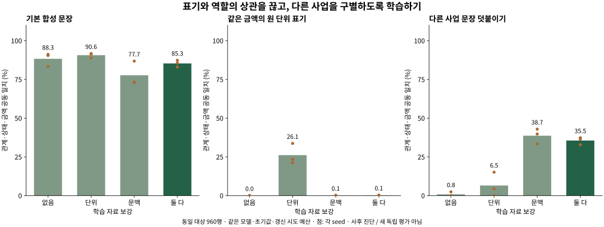

# 금액 표기·대상 문맥의 2×2 보강 진단

v3.1에서 드러난 표면 단서를 확인한 뒤 설계한 **사후 실험**입니다. 평가 자료는 이미 관측했습니다. 같은 근거 학습 모델·960개 대상 사례·라벨·초기값·300회 갱신 시도 예산을 유지하고 학습 문장에만 개입했습니다. 3개 새 조건 × 3 seed = 9회 추가 학습입니다. 보강 없음은 이미 실행한 v3.1 조건을 그대로 재사용합니다.

| 학습 자료 | 기본 공동 | 원 단위 변환 공동 | 다른 사업 추가 공동 | 공식 관계·상태 |
|---|---:|---:|---:|---:|
| 보강 없음 | 88.31% | 0.00% | 0.81% | 3.00/12 |
| 단위 표기만 | 90.62% | 26.10% | 6.48% | 3.67/12 |
| 대상 문맥만 | 77.66% | 0.06% | 38.66% | 3.00/12 |
| 둘 다 보강 | 85.30% | 0.12% | 35.53% | 3.33/12 |

모두 세 초기값 평균입니다. 공식 열은 관계·상태만, 나머지는 금액 역할까지 모두 맞아야 하는 공동 일치입니다. **새 조합은 대상 정답 라벨에서 제외**했습니다. 보강의 다른 사업 문장에는 해당 관계·상태의 조합이 텍스트로 나타날 수 있으므로, 보강 결과에 대해 전체 입력에서 한 번도 보지 않은 조합이라고 주장하지 않습니다.

## 발견한 표면 단서

최초 학습 자료에서 이전 금액 960개는 모두 만원 표기였습니다. 원 단위로 바꾼 평가에서 파서의 값·위치는 보존됐지만 금액 역할이 무너졌습니다. 단위 보강에서는 이전·후속·기타 값이 각각 원·만원·천원 표기를 갖도록 했습니다. 관계·상태 문구와 대상 금액의 실제 값은 바꾸지 않았습니다.

대상 문맥 보강은 다른 사업의 짧은 사건 설명과 두 금액을 앞·뒤에 나누어 배치합니다. 다른 사업의 관계·상태는 대상 라벨과 별도로 구성합니다. 이 두 개입을 나눠서 각 반례의 성능 변화를 봤습니다. 같은 합성 문법·인위적 사업명이라는 한계는 남습니다.

## 분해 지표

| 조건 | 변환 시 관계·상태 | 변환 시 금액 역할 | 방해 시 관계·상태 | 방해 시 금액 역할 |
|---|---:|---:|---:|---:|
| 보강 없음 | 90.68% | 0.00% | 37.85% | 3.59% |
| 단위 표기만 | 91.03% | 28.65% | 37.44% | 25.81% |
| 대상 문맥만 | 89.35% | 0.06% | 40.74% | 94.73% |
| 둘 다 보강 | 89.29% | 0.12% | 38.02% | 93.34% |

원 단위 파서는 정답 라벨 없이 입력만 읽습니다. 수치 제약은 모델이 골라낸 쌍이 이미 틀리면 이를 자동으로 복원하지 못합니다. [전체 seed·단위 분포·효과 분해](augmentation_report.json)와 각 결과 폴더의 원시 예측을 함께 보아야 합니다.

## 해석과 다음 단계

이 비교는 작성한 자료의 특정 단서에 대한 실패를 실제로 고칠 수 있는지 확인합니다. 자연 문장의 일반화, 근거의 인과적 충실성, 공식 구절의 임시 라벨 타당성은 별도입니다. 실제 공고에서 나타나는 화자·부정 범위·날짜·단위·표·문서 버전을 수집하고 독립 2인 판독으로 확인해야 합니다. 학습 결과를 본 뒤 공식 라벨을 바꾸거나 좋은 사례만 남기지 않았습니다.

