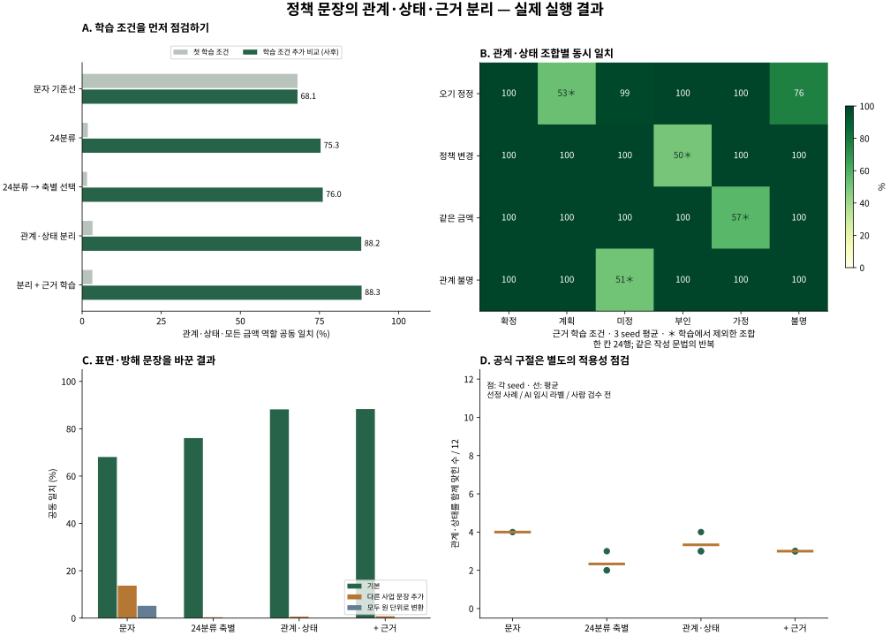

# v3 관측 결과

사후 학습 조건 비교 포함. 합성 규칙 정답·공식 AI 임시 라벨이며 사람 검수 전입니다.

| 방법 | 첫 조건 공동 일치 | 추가 조건 공동 일치 (seed 범위) | 새 조합 관계·상태 | 공식 12구절 관계·상태 |
|---|---:|---:|---:|---:|
| 문자 기준선 | 68.06% | 68.06% (68.06%–68.06%) | 50.00% | 4.00/12 |
| 24분류 | 1.79% | 75.35% (70.66%–81.77%) | 0.00% | 2.33/12 |
| 24분류 → 축별 선택 | 1.56% | 76.04% (70.66%–82.64%) | 4.86% | 2.33/12 |
| 관계·상태 분리 | 3.30% | 88.19% (83.51%–91.32%) | 48.96% | 3.33/12 |
| 분리 + 근거 학습 | 3.24% | 88.31% (83.33%–91.15%) | 52.78% | 3.00/12 |

공동 일치는 관계·상태·금액 역할 모두를 요구합니다. 공식 열은 관계·상태만이며 서로 다른 과제 조건을 합산하지 않습니다. 추가 조건은 출력층 학습률과 학습량을 함께 바꿨으므로 각각의 효과를 분리한 결과가 아닙니다.

## 모든 seed의 응답·오류

| 조건 | seed | 학습 공동 | 평가 공동 | 평가 답변/오답 | 공식 답변/오답 |
|---|---:|---:|---:|---:|---:|
| 24분류 | 17 | 100.00% | 70.66% | 314/26 | 8/7 |
| 24분류 | 42 | 100.00% | 81.77% | 576/105 | 12/11 |
| 24분류 | 2026 | 100.00% | 73.61% | 576/152 | 12/11 |
| 관계·상태 분리 | 17 | 100.00% | 83.51% | 355/17 | 9/8 |
| 관계·상태 분리 | 42 | 100.00% | 91.32% | 576/50 | 12/11 |
| 관계·상태 분리 | 2026 | 100.00% | 89.76% | 576/59 | 12/10 |
| 분리 + 근거 학습 | 17 | 100.00% | 83.33% | 373/18 | 8/7 |
| 분리 + 근거 학습 | 42 | 100.00% | 91.15% | 576/51 | 12/11 |
| 분리 + 근거 학습 | 2026 | 100.00% | 90.45% | 576/55 | 12/10 |

응답 문턱은 각 조건의 검증에서만 정했습니다. 0회 답변의 오류율은 0%가 아니라 정의되지 않음(null)입니다. 유형별 응답·오답은 [summary.json](results_fit/summary.json)의 by_class에서 전부 확인할 수 있습니다.

## 공식 구절 전체 — seed 42, 근거 학습 조건

| 사례 | 임시 관계·상태 | 모델 관계·상태 | 공동 일치 | 출처 |
|---|---|---|---|---|
| 공사비 | correction / asserted | correction / denied | 불일치 | [인천광역시 종합건설본부](https://www.incheon.go.kr/jonggeon/JO020101/3008010) |
| 자립수당 | policy_change / asserted | policy_change / planned | 불일치 | [보건복지부·정책브리핑](https://www.korea.kr/news/policyNewsView.do?newsId=148920503) |
| 원주사랑상품권 발행규모 | policy_change / asserted | policy_change / asserted | 불일치 | [원주시](https://www.wonju.go.kr/media/selectBbsNttView.do?bbsNo=145&key=3450&nttNo=416729) |
| 영아수당 | policy_change / planned | policy_change / planned | 불일치 | [저출산고령사회위원회·정책브리핑](https://www.korea.kr/news/policyNewsView.do?newsId=148881122) |
| 산불재난특수진화대 증원 및 예산 규모 | unspecified / under_review | policy_change / under_review | 불일치 | [기획예산처·정책브리핑](https://www.korea.kr/briefing/actuallyView.do?newsId=148970350) |
| 수리시설개보수 및 배수개선사업 예산 | unspecified / under_review | policy_change / under_review | 불일치 | [농림축산식품부](https://www.korea.kr/briefing/actuallyView.do?newsId=148932342) |
| 농식품 바우처 예산 | unspecified / under_review | policy_change / under_review | 불일치 | [농림축산식품부](https://www.korea.kr/briefing/actuallyView.do?newsId=148930563) |
| CBAM 적용 품목 확대 | policy_change / denied | policy_change / planned | 불일치 | [산업통상자원부](https://www.korea.kr/briefing/actuallyView.do?newsId=148932239) |
| 원전 수출체계 효율화 방안 | policy_change / under_review | policy_change / under_review | 일치 | [산업통상부](https://www.korea.kr/briefing/actuallyView.do?newsId=148963183) |
| 건강생활유지비 | policy_change / asserted | policy_change / planned | 불일치 | [보건복지부](https://www.korea.kr/news/policyNewsView.do?newsId=148931883) |
| 필수 예산 삭감을 통한 소비쿠폰 재원 마련 | policy_change / denied | unspecified / denied | 불일치 | [관계부처 합동](https://www.korea.kr/briefing/actuallyView.do?newsId=148946134) |
| 초급간부 처우개선 예산 대폭 삭감 | policy_change / denied | policy_change / hypothetical | 불일치 | [기획재정부·국방부](https://www.korea.kr/news/policyNewsView.do?newsId=148934797) |

세 초기값의 원시 출력과 모든 공식 사례는 [report.json](report.json)에 있습니다. 특정 seed나 맞힌 사례만 선정해 성능을 표시하지 않습니다. 독립 판독이 완료되면 최초 임시 라벨과 이견을 보존하고 별도의 새 평가로 기록해야 합니다.

