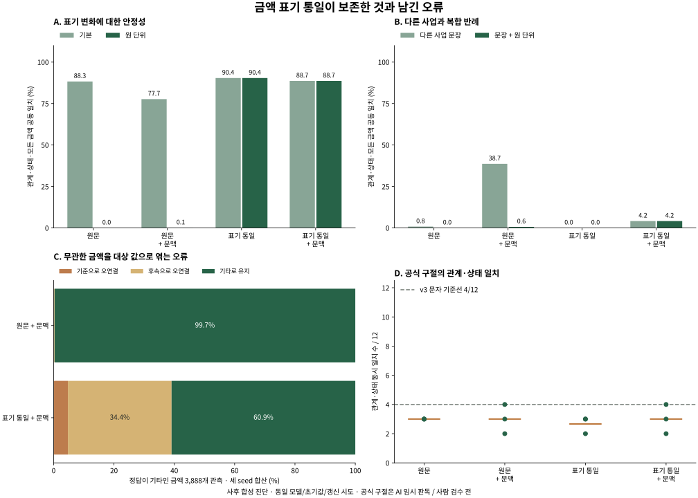

# v4 관측 결과

v3 실패 이후 설계한 사후 비교입니다. 새 학습 6회와 기존 모델 6개의 재추론을 구분합니다. 합성 문법·선정된 공식 구절·AI 임시 라벨이며 사람 검수 전입니다.

## 공동 일치: 관계·상태·모든 금액 역할

| 조건 | 기본 | 원 단위 | 다른 사업 | 두 반례 동시 | 공식 관계·상태 |
|---|---:|---:|---:|---:|---:|
| 원문 | 88.31% | 0.00% | 0.81% | 0.00% | 3.00/12 |
| 원문 + 문맥 보강 | 77.66% | 0.06% | 38.66% | 0.64% | 3.00/12 |
| 표기 통일 | 90.39% | 90.39% | 0.00% | 0.00% | 2.67/12 |
| 표기 통일 + 문맥 보강 | 88.66% | 88.66% | 4.17% | 4.17% | 3.00/12 |

세 초기값 평균입니다. 공식 열은 관계·상태만이며 나머지 공동 지표와 합산하지 않습니다. 공식 문자 기준선은 v3에서 4/12였습니다. 같은 선정 구절에 대한 비교이며 독립 실제 문서 시험이 아닙니다.

## 개선과 역효과

표기 통일만 적용한 기본·원 단위 공동 일치는 각각 90.39% / 90.39%입니다. 같은 값의 표기를 같은 입력으로 만든 결과로, 두 조건의 예측 확률도 같습니다. 이는 수치 의미를 새로 학습했다는 증거가 아니며, 같은 오답을 일관되게 낼 수도 있습니다.

문맥 보강 조건에 표기 통일을 추가한 변화는 원 단위 0.06% → 88.66%, 다른 사업 38.66% → 4.17%, 두 반례 동시 0.64% → 4.17%입니다. 한 종류의 반례 개선으로 다른 반례나 자연 문장의 판독 성능까지 설명할 수 없습니다.

| 문맥 보강 조건 | 다른 사업 반례의 관계·상태 | 모든 금액 역할 일치 | 기타 금액을 기준·후속으로 오연결 |
|---|---:|---:|---:|
| 원문 + 문맥 보강 | 40.74% | 94.73% | 0.31% (12/3888) |
| 표기 통일 + 문맥 보강 | 40.91% | 25.06% | 39.09% (1520/3888) |

오연결은 세 초기값의 개별 금액 관측을 합친 비율이며, 행 전체의 모든 역할 일치와 분모가 다릅니다. 표기 통일 + 문맥 보강의 대상 기준 역할은 1,728/1,728, 후속 역할은 1,728/1,728개를 맞혔습니다. 기타 금액 3,888개 중 1,520개를 대상 역할로 엮었습니다. **대상 값의 누락과 무관한 값의 연결을 분리해 보아야 합니다.** 오류 집계는 결과를 본 뒤의 기술적 분석이며 추가 학습하지 않았습니다.

## 모든 초기값과 보류

| 조건 | seed | 기본 공동 | 원 단위 공동 | 다른 사업 공동 | 복합 공동 | 검증 문턱 | 복합 답변 / 오답 |
|---|---:|---:|---:|---:|---:|---:|---:|
| 원문 | 17 | 83.33% | 0.00% | 0.00% | 0.00% | 0.66 | 444 / 444 |
| 원문 | 42 | 91.15% | 0.00% | 2.43% | 0.00% | 0.0 | 576 / 576 |
| 원문 | 2026 | 90.45% | 0.00% | 0.00% | 0.00% | 0.0 | 576 / 576 |
| 원문 + 문맥 보강 | 17 | 73.26% | 0.17% | 33.33% | 1.56% | 0.88 | 0 / 0 |
| 원문 + 문맥 보강 | 42 | 86.81% | 0.00% | 42.88% | 0.35% | 0.79 | 0 / 0 |
| 원문 + 문맥 보강 | 2026 | 72.92% | 0.00% | 39.76% | 0.00% | 0.89 | 0 / 0 |
| 표기 통일 | 17 | 91.32% | 91.32% | 0.00% | 0.00% | 0.62 | 218 / 218 |
| 표기 통일 | 42 | 91.32% | 91.32% | 0.00% | 0.00% | 0.57 | 177 / 177 |
| 표기 통일 | 2026 | 88.54% | 88.54% | 0.00% | 0.00% | 0.0 | 576 / 576 |
| 표기 통일 + 문맥 보강 | 17 | 89.06% | 89.06% | 2.08% | 2.08% | 0.89 | 19 / 19 |
| 표기 통일 + 문맥 보강 | 42 | 89.58% | 89.58% | 5.38% | 5.38% | 0.84 | 19 / 17 |
| 표기 통일 + 문맥 보강 | 2026 | 87.33% | 87.33% | 5.03% | 5.03% | 0.94 | 0 / 0 |

보류 문턱은 원래 검증 160행에서 선택했습니다. 새 반례 분포의 오류를 보장하지 않습니다. 답변 0개는 판독 능력의 증명이 아니며, 낮은 답변 오류와 충분한 유형별 답변율을 함께 보아야 합니다. [전체 유형별 답변·오류](summary.json)에 공식 구절까지 포함했습니다.

## 수치 제약의 별도 비교

| 조건 | 기본 공동 | 원 단위 공동 | 다른 사업 공동 | 복합 공동 |
|---|---:|---:|---:|---:|
| 원문 | 88.83% | 0.00% | 0.81% | 0.00% |
| 원문 + 문맥 보강 | 77.78% | 0.06% | 38.66% | 0.64% |
| 표기 통일 | 90.91% | 90.91% | 0.00% | 0.00% |
| 표기 통일 + 문맥 보강 | 88.72% | 88.72% | 4.17% | 4.17% |

모델이 선택한 금액 역할을 사용한 제약이며 정답 역할을 넣지 않았습니다. 무관한 금액을 연결하는 오류나 화자·부정 범위를 자동으로 복원하지 못합니다.

## 제한된 쌍 비교와 정보 손실

미리 정한 복합 반례 비교의 차이는 3.53%p, frame 묶음 bootstrap 구간은 2.43–4.46%p입니다. 단 6개의 합성 frame 안에서 초기값 평균의 차이를 재표집한 값이며, 자연 문장 모집단이나 사람 판독 불확실성의 신뢰구간이 아닙니다.

표기 통일은 다른 실제 값까지 같은 문맥 표현으로 만듭니다. [정보 손실 예시](data/value_information.json)에서 동일 금액과 다른 금액이 같은 모델 입력에 대응합니다. 값·원문 위치를 별도로 보관해도 인코더 자체의 크기·방향·비교 추론 능력이 복원되는 것은 아닙니다.

## 다음 검증 질문

다음 후보는 금액마다 사업·사건·화자와 연결되는 범위를 명시하는 판독입니다. 예컨대 금액 주변 표기를 지우더라도 대상 사업의 금액만 남기는지, 다른 기관의 부인 문장이 들어와도 대상의 상태가 유지되는지 비교해야 합니다. 현재 결과는 이 구조를 아직 구현·검증한 것이 아닙니다. 새 실제 공고 버전과 독립 2인 판독도 별도로 필요합니다.

