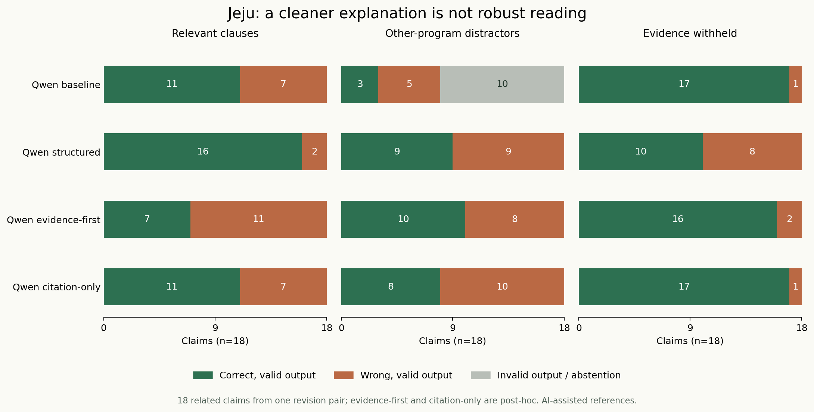
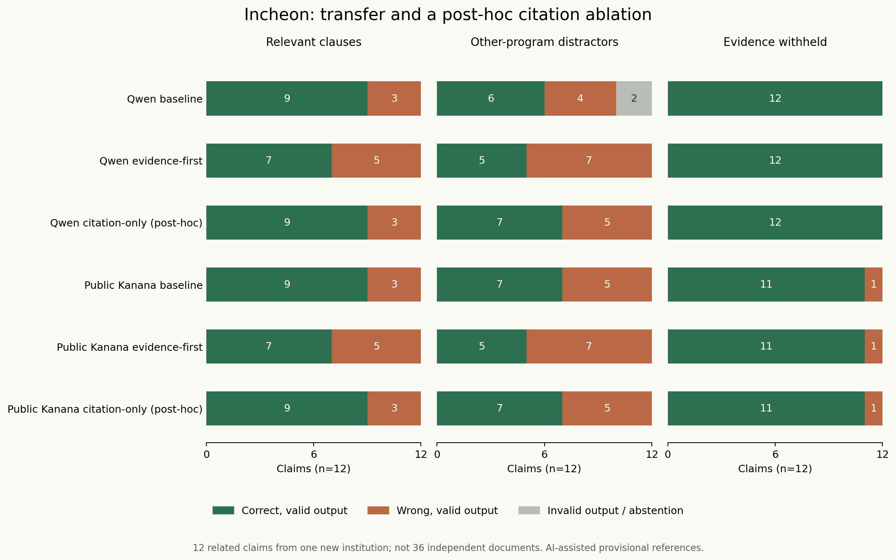
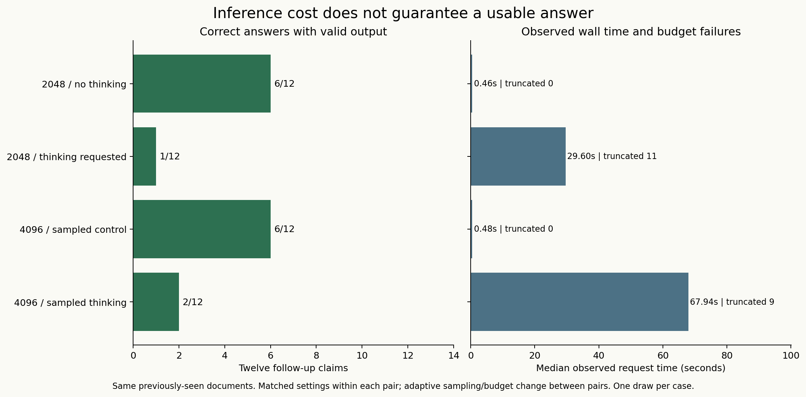

# 실행 결과 · 2026-10-01

최초 실험 응답 **1182개**, 별도 재실행 **12개**를 저장했습니다. 이는 원문 3개·기관 2곳의 기본 주장 30개, 변형, 가상 개발·구성, 동일 원문의 후속 주장을 여러 설정에서 반복한 수입니다. 독립 정책 사례나 독립 사람 정답의 수가 아닙니다. 답이 끝나지 않은 HTTP 응답도 실패로 포함했습니다. 모델 등록 중 실패한 HTTP 요청을 정답 사례로 세지 않았습니다.

각 셀은 **정상 출력 기준 정답 수 / 정답과 필요 근거가 함께 맞은 수**입니다. 정답은 유효한 JSON과 입력에 존재하는 비어 있지 않은 근거 ID 목록을 반환하면서 의미 답도 맞아야 셉니다. 형식 오류를 무시한 의미 답의 정답 수는 아래 분리 표로 제공합니다. 분모는 열 제목에 표시했습니다. 모든 기준은 AI 지원 잠정 판독이며, 독립 사람 검수 0명입니다. 모델 이름 `kanana`는 최초 로컬 가중치, `kanana-public`은 공개 배포본의 파일 해시를 대조한 별도 양자화 가중치입니다.

## 첫 단계: 기본·설명 구조화·선택적 보류

| 방법 | 개발 24 | 구성 48 | 제주 기본 18 | 혼입 18 | 가림 18 |
|---|---|---|---|---|---|
| consensus-baseline | 11 / 11 | 23 / 22 | 8 / 7 | 2 / 2 | 17 / 16 |
| consensus-scoped | 10 / 10 | 19 / 19 | 8 / 8 | 3 / 2 | 10 / 10 |
| consensus-scoped-guard | 9 / 9 | 16 / 16 | 6 / 6 | 3 / 2 | 9 / 9 |
| kanana-baseline | 12 / 12 | 27 / 24 | 10 / 9 | 5 / 4 | 18 / 17 |
| kanana-scoped | 11 / 11 | 25 / 25 | 8 / 8 | 7 / 6 | 18 / 15 |
| kanana-scoped-guard | 9 / 9 | 21 / 21 | 6 / 6 | 4 / 3 | 15 / 12 |
| qwen-baseline | 19 / 19 | 36 / 33 | 11 / 10 | 3 / 2 | 17 / 7 |
| qwen-scoped | 20 / 20 | 41 / 38 | 16 / 14 | 9 / 7 | 10 / 2 |
| qwen-scoped-guard | 19 / 19 | 41 / 38 | 12 / 10 | 8 / 6 | 10 / 2 |

## 두 번째 단계: 공개 가중치·근거 충분성

| 방법 | 개발 24 | 제주 기본 18 | 혼입 18 | 가림 18 | 인천 기본 12 | 혼입 12 | 가림 12 |
|---|---|---|---|---|---|---|---|
| kanana-public-baseline | 12 / 12 | 10 / 9 | 5 / 4 | 18 / 17 | 9 / 8 | 7 / 6 | 11 / 11 |
| kanana-public-evidence | 8 / 8 | 6 / 5 | 2 / 1 | 18 / 16 | 7 / 6 | 5 / 3 | 11 / 10 |
| qwen-baseline | 19 / 19 | 11 / 10 | 3 / 2 | 17 / 7 | 9 / 8 | 6 / 6 | 12 / 12 |
| qwen-evidence | 16 / 16 | 7 / 7 | 10 / 9 | 16 / 8 | 7 / 6 | 5 / 4 | 12 / 12 |

## 세 번째 단계: 같은 2,048 출력 설정에서 추론 모드

| 방법 | 인천 기본 12 | 혼입 12 | 가림 12 | 후속 12 |
|---|---|---|---|---|
| qwen-budget-control | 9 / 8 | 6 / 6 | 12 / 12 | 6 / 5 |
| qwen-thinking | 5 / 5 | 0 / 0 | 0 / 0 | 1 / 1 |

## 추가 디코딩: 같은 4,096 설정·같은 샘플링에서 모드 비교

| 방법 | 후속 12 |
|---|---|
| qwen-sampled-control | 6 / 4 |
| qwen-sampled-thinking | 2 / 1 |

## 사후 분리 실험: 기본 프롬프트에서 근거 ID만 제한

| 방법 | 제주 기본 18 | 혼입 18 | 가림 18 | 인천 기본 12 | 혼입 12 | 가림 12 |
|---|---|---|---|---|---|---|
| kanana-public-baseline | 10 / 9 | 5 / 4 | 18 / 17 | 9 / 8 | 7 / 6 | 11 / 11 |
| kanana-public-citation-only | 10 / 9 | 4 / 3 | 18 / 17 | 9 / 8 | 7 / 6 | 11 / 11 |
| kanana-public-evidence | 6 / 5 | 2 / 1 | 18 / 16 | 7 / 6 | 5 / 3 | 11 / 10 |
| qwen-baseline | 11 / 10 | 3 / 2 | 17 / 7 | 9 / 8 | 6 / 6 | 12 / 12 |
| qwen-citation-only | 11 / 10 | 8 / 7 | 17 / 7 | 9 / 8 | 7 / 6 | 12 / 12 |
| qwen-evidence | 7 / 7 | 10 / 9 | 16 / 8 | 7 / 6 | 5 / 4 | 12 / 12 |

첫 단계의 구조화 프롬프트는 개발 오류를 보고 고정했습니다. 두 번째 단계의 근거 충분성 방식은 제주 평가를 본 뒤 만들어 제주 열은 사후 진단입니다. 인천은 그 방법을 고정한 뒤 전체 원문과 잠정 주석을 작성한 첫 기관 전이입니다. 이후 추론·샘플링·근거 ID 제한은 관측한 실패에 대응한 적응적 후속 비교입니다. 후속 12개는 같은 원문에서 만든 새 주장으로 외부 문서 평가가 아닙니다.

## 출력 형식 개선과 내용 판독 개선의 분리

기본 프롬프트·디코딩·출력 필드를 유지하고 근거 목록에 입력 ID의 enum 및 최소 길이 1만 지정했습니다. 앞선 응답을 고친 것이 아니라 두 모델에 제주·인천의 90개 입력을 새로 실행한 180개 최초 응답입니다. 기본·근거 충분성 결과는 기존 응답을 재사용합니다.

| Qwen 혼입 조건 | 방식 | 형식 무시 의미 정답 | 정상 출력 정답 | 정답+근거 | 없는 근거 ID |
|---|---|---:|---:|---:|---:|
| 제주 18 | baseline | 8 | 3 | 2 | 10 |
| 제주 18 | citation-only | 8 | 8 | 7 | 0 |
| 제주 18 | evidence | 10 | 10 | 9 | 0 |
| 인천 12 | baseline | 7 | 6 | 6 | 2 |
| 인천 12 | citation-only | 7 | 7 | 6 | 0 |
| 인천 12 | evidence | 5 | 5 | 4 | 0 |

제주 혼입에서 ID 제한은 정상 출력 기준 정답을 3개에서 8개로 늘렸지만 의미 답 자체의 정답은 8개로 같았습니다. 출력 계약을 개선한 효과를 내용 이해의 개선으로 설명하지 않습니다. 근거 충분성 방식은 프롬프트와 필드도 함께 바뀌므로 ID 제한만의 효과와 구별해야 합니다. Kanana의 제주 혼입 정답은 5개에서 4개로 감소해 ID 제한이 모든 모델의 판독을 개선한 것도 아닙니다.

## 답변 실패와 관측 시간

두 설정 묶음 사이에는 출력 설정과 샘플링이 함께 바뀝니다. 같은 묶음 안에서는 추론 모드 유무만 다릅니다. 아래는 후속 주장 12개에서 측정한 요청 시간으로, 공유 환경·단일 실행의 관측값입니다. API `eval_count`가 전체 추론을 포괄하지 않는 사례가 있어 이를 총 토큰 비용으로 쓰지 않았습니다.

| 설정 | 한도 소진 | 요청 시간 중앙값(초) | API eval_count 중앙값(참고) |
|---|---:|---:|---:|
| 2048 / greedy / no thinking | 0/12 | 0.464 | 18 |
| 2048 / greedy / thinking | 11/12 | 29.598 | 2048 |
| 4096 / sampled / no thinking | 0/12 | 0.478 | 15.5 |
| 4096 / sampled / thinking | 9/12 | 67.941 | 4096 |

추론문 속에 답처럼 보이는 표현이 있더라도 최종 응답이 없으면 정답으로 끌어내지 않았습니다. 출력 실패로 모두 보류하면 잘못된 확정은 0이 될 수 있지만 유용한 판독기가 된 것은 아닙니다. [클래스별 혼동·잘못된 미확인·출력 비율](results/class_diagnostics.json)을 함께 확인합니다.

## 사전에 고른 여섯 사례의 재실행

의미 정답 클래스별로 사례 ID의 SHA-256 순서에서 두 개씩 고른 뒤 같은 요청을 한 번 더 실행했습니다. 아래 일치 수에는 양쪽 모두 출력 실패인 경우가 포함될 수 있어 별도 열로 구분합니다.

| 방법 | 같은 의미 답 | 같은 답+근거 | 처음 유효 출력 | 반복 유효 출력 | 양쪽 모두 보류 |
|---|---:|---:|---:|---:|---:|
| kanana-public-baseline | 6/6 | 6/6 | 6/6 | 6/6 | 0/6 |
| qwen-thinking | 6/6 | 6/6 | 3/6 | 3/6 | 3/6 |

이는 작은 재현 점검이며 환경 간 재현성이나 출력 안정성의 보장이 아닙니다. 저장된 첫 응답의 전수 재집계와 모델의 재추론을 구분합니다.

## 그림과 세부 기록

- [최초 단계의 모든 사례](results/case_scores.json), [두 번째 단계의 모든 사례](results/extension/case_scores.json)
- [추론 모드의 모든 사례](results/thinking/case_scores.json), [샘플링의 모든 사례](results/sampling/case_scores.json)
- [근거 ID만 제한한 분리 실험](results/citation/case_scores.json)
- [방법 변경으로 얻고 잃은 정답](results/extension/paired_changes.json), [추론 모드의 쌍별 변화](results/thinking/paired_changes.json)
- [확정 가능성 주장의 주석 해석 민감도](results/annotation_sensitivity.json)
- [원요청·입력·모델·고정 시각 전수 점검](results/request_audit.json), [재실행 사례](results/repeat/cases.json)

일부 조건에서 성공한 방식이 다른 조건에서도 우수하다는 결론을 내리지 않습니다. ‘최고 모델’ 순위나 한국어 정책 전체의 정확도를 추정하지 않으며, 각 실패가 근거 선택·적용 범위·명제의 확정성·출력 종료 중 어디에 걸리는지 다음 구현이 확인할 수 있도록 남깁니다.
