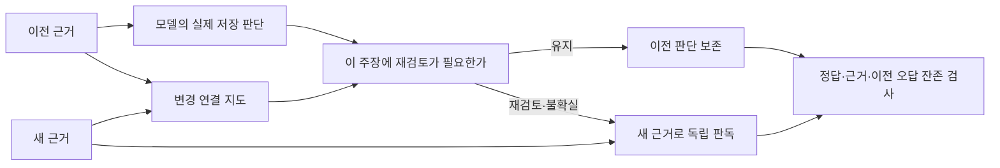

# 정정 뒤에 무엇을 다시 읽어야 하는가

한국어 정책의 **변경 탐지 → 적용 대상 연결 → 저장 판단의 선택적 갱신**을 분리해 검증한다. 이전 연구가 한 번의 조건 판독을 비교했다면, 이번 연구는 실제 모델이 전에 남긴 오답까지 포함한 상태에서 새 근거를 받아 판단을 유지하거나 갱신한다.

금액이 바뀌었다는 사실만으로 모든 사람의 답이 바뀌지는 않는다. 반대로 정책이 그대로여도 예전에 저장한 답은 틀렸을 수 있다. 이 두 실패를 같은 ‘정정 정확도’로 묶지 않는 것이 이 실험의 중심이다.

[결과와 실패 분석](RESULTS.md) · [방법과 고정 시점](protocol.json) · [추가 방법](extension_protocol.json) · [새 자료의 출처·주석 규약](source_amendment.json) · [웹 연구 노트](https://soccz.github.io/projects/market-impact-research/#selective-update)

## 실행 흐름



지도 생성에는 주장을 주지 않고 두 버전의 근거만 제공한다. 게이트에는 주장과 이전 모델의 근거 ID를 제공하며 이전 정답 라벨은 제공하지 않는다. 새 판독은 저장한 결론을 받지 않는다. 참조 주석은 어떤 모델 요청에도 넣지 않는다. 지도와 근거 ID는 모델 출력이며 검증된 증명으로 간주하지 않는다.

## 자료와 평가 단위

| 구분 | 주장 | 자료 | 역할 |
|---|---:|---|---|
| 가상 개발 | 24 | 작성한 8개 규정 세계 | 프롬프트·방법 개발 |
| 기존 제주 | 6 | 앞 연구에서 이미 본 수정 전후 공고 | 알려진 자료의 진단 |
| 새 충남 | 16 | 2025-158 → 2025-185, 5쪽씩 | 같은 해 수정 공고 |
| 새 서울 | 16 | 2024-3494 → 2025-1082, 12쪽씩 | 연도 간 규정 비교 |

새 32개 주장을 **선별한 관련 조항**과 **전체 PDF 검색** 두 입력으로 평가한다. 실제 신규 문서는 4개, 문서 계열은 2개다. 64개 입력을 독립 정책 사건 64개로 세지 않는다. 규칙의 가상 조건 비교이며 당시의 실제 수급 자격에 대한 안내가 아니다.

서울 2024년 최초본은 확보하지 못했다. 따라서 2024년 말 수정본과 2025년 수정본을 비교했다. 두 문서를 원래 계획했던 2024년의 최초·수정 쌍으로 부르지 않는다. [수집 변경 기록](source_amendment.json)과 [4개 문서·해시·URL](sources.json)을 남겼다. 별첨 자격종목 목록처럼 수집하지 않은 자료를 근거로 하는 주장은 제외했다.

## 비교 방법

| 방법 | 재판독 조건 | 추가 모델 호출 |
|---|---|---|
| 모두 갱신 | 모든 주장 | 새 판독만 |
| 인용 문장 변경 | 이전 인용문이 새 근거에 그대로 없을 때 | 없음 |
| 해시 감사 | 고정 SHA-256 나머지 분할에 속하거나 출력 무효 | 없음 |
| 직접 적용 범위 | 모델이 재검토 또는 불확실로 판독 | 주장별 게이트 |
| 변경 지도 | 지도와 원문을 함께 본 게이트 | 근거 묶음별 지도 + 주장별 게이트 |
| 지도 + 감사 | 위 조건, 이전 미확인, 고정 해시 분할 | 지도와 게이트 재사용 |

해시 감사는 약 1/4로 정의한 고정 분할이며 작은 표본에서 실제 25%를 보장하지 않는다. 모든 방법은 같은 실제 이전·새 예측을 재사용한다. 호출을 아낀 수는 **가정한 실행 경로의 계산**이다. 모델 호출은 실험에서 전부 수행했으며 실제 운영 지연 감소를 측정한 것이 아니다. 지도·게이트 비용도 포함해 비교한다.

인용 문장 기준선은 공백 정규화 뒤 완전 일치만 비교한다. 기존 문장이 유지된 채 예외가 추가되면 놓칠 수 있고, PDF 줄 배치나 검색 창의 위치가 바뀌면 의미가 같아도 갱신할 수 있다.

## 검색과 후속 실험

전체 34쪽을 페이지별로 추출한다. 서식도 후보에 포함한다. 500자 창, 400자 간격, 문자 2–4그램 TF-IDF, 버전별 상위 3개로 고정했다. 주장만 검색 질의에 사용한다. [검색 코드](retrieve.py)는 새 전문을 읽기 전에 고정했다.

후속으로 최대 5개 창의 분량에서 상위 5개와 상위 3개+인접 창을 비교했다. 필수 원문 범위를 덜 가져온 방법도 결과에서 제외하지 않았다. 이는 같은 자료의 검색 누락을 보고 설계한 **탐색적 보완**이며 독립 전이 검증이 아니다. [후속 고정 기록](repair_freeze.json)

사전에 지정한 원문 구간의 포함 여부와 판독 정답을 따로 계산한다. 검색 누락 상태에서 `not_established`로 답하는 것은 입력에 충실할 수 있으나 전체 문서 문제를 해결한 것은 아니다. 단일 ID 집합의 기존 채점과 겹치는 검색 창을 인정하는 원문 구간 합집합 채점을 함께 보존한다.

## 해석 규약

- `supported / contradicted / not_established`: 입력이 주장을 지지 / 반박 / 확정하지 못함. 출력 형식·인용 ID가 무효이면 별도의 `abstain`이다.
- 전후 정답이 같아도 해당 조건의 기준 자체가 바뀌면 재검토가 필요할 수 있다. 명시된 예외 대상에 변화가 적용되지 않는 경우와 구분한다.
- `false_flip`은 참조 답이 같은 사례에서 모델 답이 달라진 수다. **이전 오답을 고친 변화도 포함**하므로 모두 해로운 변경으로 부르지 않는다. `harmful_refresh`를 별도로 보고한다.
- 이전 오답 잔존과 놓친 규정 변경을 분리한다. 참조 경로를 완벽히 아는 진단용 oracle도 이전 오답을 남길 수 있다. oracle은 배포 가능한 방법이 아니다.
- 저장 라벨 순환 교란은 실제 예측의 근거 ID를 유지하고 라벨만 S→C→U→S로 바꾼 통제 실험이다. 게이트가 받는 입력은 동일하다. 자연 발생 오답률로 해석하지 않는다.
- 새 판단의 정답+현재 근거 점수와, 유지된 옛 판단의 정답은 다른 지표다. 옛 인용 ID를 새 근거인 것처럼 바꾸어 채점하지 않는다.

## 재현

Python 3.12와 [고정 의존성](requirements.txt)을 사용한다. Ollama 모델 계보는 이전 [모델 확인 기록](../policy_scope_reading/models.json)을 참고한다. 이 연구는 `qwen3.5:9b`와 공개 배포본 해시를 확인한 `policy-kanana15-public:q4km-f7ae0cc1`만 사용한다. 신규 모델 학습은 없다. 요청 설정·서버 버전·모델 digest·요청 해시는 각 결과에 남겼다.

```bash
python3 -m unittest discover -s research/policy_selective_update -p 'test_*.py'
python3 research/policy_selective_update/verify.py
# 공식 첨부가 같은 바이트로 제공되는 동안 원문과 입력도 재구성 가능
python3 research/policy_selective_update/prepare_inputs.py --cache /tmp/policy-update-sources --download
python3 research/policy_selective_update/expand_retrieval.py --cache /tmp/policy-update-sources
```

`infer.py --inputs <입력 JSON> --output <별도 캐시> --model qwen`으로 새 실행을 할 수 있다. 비교할 원응답을 덮어쓰지 않으며 요청 해시·모델 digest가 맞지 않으면 중단한다. 모델 재실행의 바이트 동일성이나 다른 환경의 속도는 보장하지 않는다. 공개 결과만의 채점 재생성과 비공개 원문·최초 응답 대조를 구분한다.

## 범위와 연구 위치

주석은 AI가 작성한 잠정 기준이며 **독립 사람 검수는 0명**이다. [빈 검수 양식](human_review.tsv)과 [판독 지침](ANNOTATION.md)을 제공한다. 출처 선택은 목적 표집이고 외부 사전등록이 아니다. 같은 정책에서 만든 여러 주장 사이에는 의존성이 있다. 주장 단위 유의확률로 기관 전체의 우월성을 주장하지 않는다.

개발용 제주 사례는 이미 관측한 자료다. 이전 입력에 날짜별 적용 맥락이 충분하지 않아 이전 판단의 미확인이 많았다. 참조는 고정 프로필에 옛 규칙을 투영하는 규약이다. 이를 일반적인 모델 성능이나 독립 실패 증거로 과장하지 않는다. 새 자료에서는 조건 비교와 실제 수급권을 문장에 구분했다.

증거의 변화에 대한 사실 검증 민감도는 [VitaminC (NAACL 2021)](https://aclanthology.org/2021.naacl-main.52/), 시간 표현과 증거 검색의 관계는 [TimeMatters (EMNLP Industry 2024)](https://aclanthology.org/2024.emnlp-industry.48/)를 참고한다. 정정 대응 자체를 새로운 분야로 주장하지 않는다. 여기서는 한국어 공고의 적용 범위와 **이미 틀릴 수 있는 저장 판단**을 함께 평가하는 실험으로 구체화했다.

공개 파일은 코드·직접 작성한 가상 주장·출처 위치와 해시·판정과 근거 ID·집계·그림이다. 공식 문서 전체와 추출 전문, 원문이 포함된 입력, 변경 지도 설명 원문은 공개하지 않는다. 기존 서울경제 협업·납품 자료는 사용하지 않았다. 새로운 개인 연구의 AI 지원 실행 기록이며 이전 개발 성과와 구분한다.

날짜 조건의 좁은 후속 실험은 [고정 기록](contract_freeze.json)에 범위를 명시했다. 두 모델이 이전·갱신 후 금액 조항을 날짜 구간으로 추출하고, 같은 금액 조항만 제공한 직접 판독 6개 및 날짜·금액 조합 12개와 대조했다. 조건 추출과 계산의 분리 가능성을 보지만, 금액 조항 선택과 질문 슬롯은 제공한 진단이다. Kanana의 이전 규칙 추출은 원문에 없는 연도를 만들어 구간 검사에서 거절됐다.

[근거 구간 민감도](support_sensitivity.json)는 최초 응답을 본 뒤, 관련 없는 이웃 규정까지 포함했던 10개 주장의 참조 구간을 더 짧게 지정한 별도 분석이다. 기존 답·경로·근거 ID·점수는 수정하지 않았다. 이 차이는 근거 채점의 주석 선택에 대한 민감도이며 모델 개선이 아니다.
