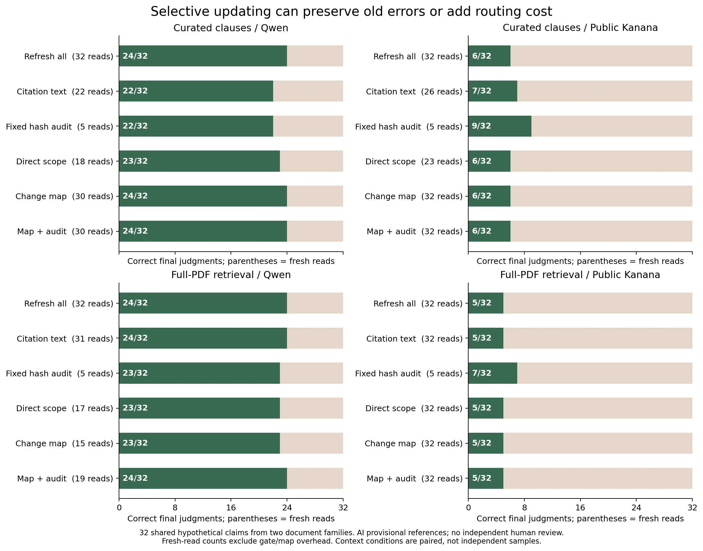
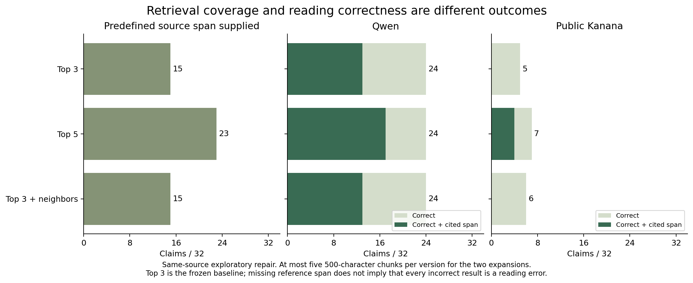
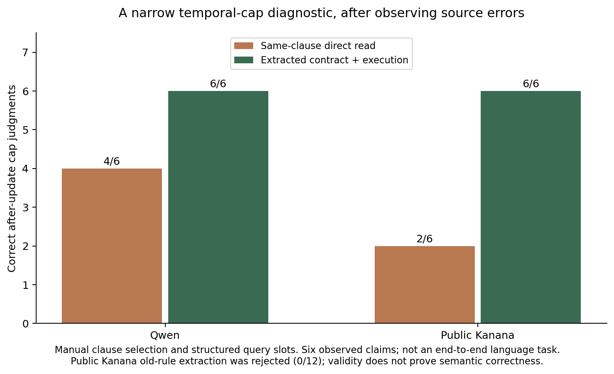

# 선택적 정정 갱신 실험 결과

**변경 지도만으로는 정확하고 효율적인 갱신이 되지 않았다.** 새 자료의 Qwen·관련 조항 조건에서 모두 갱신과 지도 방식은 모두 24/32였지만, 지도는 새 판독을 2회만 피하면서 지도·게이트를 합해 가정상 64호출이 필요했다. 원래 답의 정확성, 새 근거의 검색, 적용 대상 해석을 별도로 다뤄야 했다.

후속 날짜 한도 실험은 더 좁은 분해가 가능함을 보였다. 금액 조항을 날짜 구간으로 추출하고 실행했을 때 두 모델 모두 이미 관측한 6개 주장을 맞혔다. 같은 금액 조항의 직접 판독은 Qwen 4/6, 공개 Kanana 2/6이었다. **이것은 금액 조항 위치와 질문 슬롯을 제공한 사후 진단**이며 일반 NLP 성능이 아니다. Kanana의 이전 규칙 추출은 없는 연도를 만들어 거절됐다.

## 실행과 평가 범위

최초 응답 **982개**: 개발 208, 기존 제주 50, 새 조항 조건 260, 새 검색 조건 320, 검색 보완 128, 날짜 조건 진단 16. 지도·이전 판독·새 판독·게이트는 별개의 호출이다. 982개를 독립 주장이나 문서의 수로 세지 않는다. 새로운 주장은 두 문서 계열의 32개이고, 새 PDF는 4개/34쪽이다. 독립 사람 검수 0명, 신규 모델 학습 0회.

원래 방법과 검색 코드는 새 전문을 읽기 전에 고정했다. 검색 요약과 개발 실패는 이미 봤다. 새 자료 참조는 최초 예측 전에 고정했으며 목적 표집·AI 잠정 주석이다. 후속 검색과 날짜 조건 방식, 짧은 근거 구간의 민감도는 같은 자료를 관측한 뒤 만든 탐색으로 구분했다. 서울의 확보 실패와 연도 간 쌍으로의 변경도 첫 새 예측 전에 기록했다.

## 실제 저장 판단을 출발점으로 한 비교

정답은 갱신 후 최종 판단, 전후 동시 정답은 이전 모델 답까지 맞은 수다. ‘필요 재검토 누락’의 분모는 13개이며 갱신 후 정답 변화의 9개와 다르다. ‘옛 오답 잔존’은 이전도 틀렸고 유지한 최종 답도 틀린 사례다. 방법의 정답 수만으로 경로 판독이 정확했다고 추정하지 않는다.

### 관련 조항 제공 · 각 32개

| 모델·방법 | 최종 정답 | 전후 동시 정답 | 재판독 | 필요 재검토 누락 | 옛 오답 잔존 |
|---|---:|---:|---:|---:|---:|
| Qwen · 지도 + 감사 | 24 | 17 | 30 | 0 | 0 |
| Qwen · 변경 지도 | 24 | 17 | 30 | 0 | 0 |
| Qwen · 인용 문장 변경 | 22 | 17 | 22 | 0 | 3 |
| Qwen · 직접 적용 범위 | 23 | 18 | 18 | 6 | 3 |
| Qwen · 고정 해시 감사 | 22 | 18 | 5 | 11 | 6 |
| Qwen · 모두 갱신 | 24 | 17 | 32 | 0 | 0 |
| 공개 Kanana · 지도 + 감사 | 6 | 4 | 32 | 0 | 0 |
| 공개 Kanana · 변경 지도 | 6 | 4 | 32 | 0 | 0 |
| 공개 Kanana · 인용 문장 변경 | 7 | 5 | 26 | 0 | 4 |
| 공개 Kanana · 직접 적용 범위 | 6 | 4 | 23 | 4 | 7 |
| 공개 Kanana · 고정 해시 감사 | 9 | 7 | 5 | 11 | 16 |
| 공개 Kanana · 모두 갱신 | 6 | 4 | 32 | 0 | 0 |

### 전체 PDF 검색 · 각 32개

| 모델·방법 | 최종 정답 | 전후 동시 정답 | 재판독 | 필요 재검토 누락 | 옛 오답 잔존 |
|---|---:|---:|---:|---:|---:|
| Qwen · 지도 + 감사 | 24 | 18 | 19 | 4 | 0 |
| Qwen · 변경 지도 | 23 | 18 | 15 | 5 | 1 |
| Qwen · 인용 문장 변경 | 24 | 18 | 31 | 0 | 0 |
| Qwen · 직접 적용 범위 | 23 | 18 | 17 | 4 | 3 |
| Qwen · 고정 해시 감사 | 23 | 17 | 5 | 11 | 5 |
| Qwen · 모두 갱신 | 24 | 18 | 32 | 0 | 0 |
| 공개 Kanana · 지도 + 감사 | 5 | 3 | 32 | 0 | 0 |
| 공개 Kanana · 변경 지도 | 5 | 3 | 32 | 0 | 0 |
| 공개 Kanana · 인용 문장 변경 | 5 | 3 | 32 | 0 | 0 |
| 공개 Kanana · 직접 적용 범위 | 5 | 3 | 32 | 0 | 0 |
| 공개 Kanana · 고정 해시 감사 | 7 | 5 | 5 | 11 | 18 |
| 공개 Kanana · 모두 갱신 | 5 | 3 | 32 | 0 | 0 |

Qwen의 이전 정답은 관련 조항 21/32, 검색 20/32다. Kanana는 각각 10/32, 7/32다. 낮은 이전 정답을 참조 정답으로 교체하지 않았다. 공개 Kanana의 새 관련 조항 답은 미확인 24개·지지 7개·무효 출력 1개였고, 검색은 미확인 28개·지지 4개였다. 이는 이 프롬프트·양자화·출력 제약·자료에서의 결과다. 모델 제품 전체의 능력 순위로 일반화하지 않는다.

가상 개발에서 Qwen 지도 20/24 → 지도+감사 21/24였지만, 새 관련 조항에서는 둘 다 24/32였다. 개발에서 보인 이득이 모든 새 입력에 옮겨가지 않았다. 해시 감사가 새 자료에서 선택한 것은 5/32이며 25%의 정확한 표본 수를 강제한 실험이 아니다.

## 단순 정답 수가 숨기는 실패

- **적용 대상:** 서울의 가입일 이전 집단은 한도가 유지된다. Qwen의 관련 조항 판독은 3월 30일 가입자에게도 갱신 후 40만원을 지지하고 30만원을 반박했다. 변화의 존재와 적용 대상을 혼동한 사례다.
- **정보 부족:** 충남의 다른 사업 연계 지원에서 항목·금액 구분 여부가 주어지지 않은 주장을 Qwen은 지지했다. 예외 조항의 존재가 그 예외 충족을 증명하지는 않는다.
- **유지의 위험:** 참조 경로를 그대로 쓰는 진단용 oracle도 Qwen 관련 조항에서 이전 오답 5개를 남긴다. Kanana는 13개다. 정확한 변경 경로가 캐시의 신뢰성을 보장하지 않는다.
- **재판독의 위험:** Qwen 모두 갱신은 관련 조항의 참조 답이 같은 23개 중, 이전 정답을 새 오답으로 바꾼 사례가 4개다. 이 지표와 단순 답 변경은 다르다. 원래 오답을 고친 변경도 있기 때문이다.
- **같은 답, 다른 근거 상태:** Qwen의 새 판독은 두 입력에서 모두 24/32였지만, 지정한 현재 원문 구간까지 인용한 정답은 관련 조항 24/32, 검색 13/32였다. 지정 구간이 최소 충분 근거와 항상 같지는 않아 별도 민감도를 아래에 제시한다.

가상 라벨 교란에서는 근거 ID를 유지하고 S→C→U→S로 순환했다. 게이트 입력이 동일하므로 재호출 없이 고정 게이트를 재사용했다. Qwen 지도+감사의 최종 정답은 관련 조항 22/32, 검색 17/32이고, 이전 오답 잔존은 각각 2개·8개였다. 이는 의도적 스트레스이며 자연 발생 오답률이 아니다. [전체 경로·교란·계층 분석](results/retrieved/diagnostics.json)

## 호출 수와 비용

새 판독을 모두 실제 실행한 뒤 각 선택 경로를 재생했다. 다음은 이전 캐시를 이미 갖고 있다는 가정의 호출 수다. 실제 갱신 서비스를 운영하며 측정한 지연이나 절감량은 아니다. 지도는 관련 조항에서 문서 묶음별 2개, 검색에서는 주장별 32개여서 재사용 범위가 다르다.

| 모델·입력 | 모두 갱신 | 직접 범위 | 지도 | 지도+감사 |
|---|---:|---:|---:|---:|
| Qwen · 조항 | 32 | 50 | 64 | 64 |
| Kanana · 조항 | 32 | 55 | 66 | 66 |
| Qwen · 검색 | 32 | 49 | 79 | 83 |
| Kanana · 검색 | 32 | 64 | 96 | 96 |

같은 경로에 속한 단계의 관측 시간을 합산한 값도 JSON에 남겼다. 모델 적재·캐시·호출 순서·공유 환경이 통제된 속도 벤치마크는 아니다. API `eval_count`를 추론을 포함한 총 토큰 비용으로 환산하지 않는다. 여기서 지도 방법의 비용 우위를 입증하지 못했다.

## 검색 보완: 같은 최대 분량에서 무엇을 가져올까

상위 3개 입력의 지정 구간 포함은 이전 16/32, 갱신 후 15/32였다. 이를 관측하고 상위 5개와 상위 3개+인접 창을 고정해 비교했다. 각 후속 조건은 버전별 최대 5×500자이며 실제 토큰 수가 완전히 같지는 않다. 원래 입력·예측은 바꾸지 않았다.

| 방법 | 갱신 후 지정 구간 포함 | Qwen 정답 / 구간 포함 정답 | Kanana 정답 / 구간 포함 정답 |
|---|---:|---:|---:|
| 상위 3개 | 15/32 | 24 / 13 | 5 / 0 |
| 상위 5개 | 23/32 | 24 / 17 | 7 / 4 |
| 상위 3개+인접 창 | 15/32 | 24 / 13 | 6 / 0 |

상위 5개는 Qwen의 최종 정답 수를 높이지 않았지만 지정 구간을 인용한 정답을 13→17개로 높였다. 인접 확장은 이 원문 구간 기준의 포함 수를 늘리지 못했다. 개선되지 않은 결과도 남긴다.

### 근거 주석의 민감도

처음에는 EXCLUSIONS·INCOME 등 선별한 문단 전체를 참조 구간으로 지정했다. 일부 주장에는 이웃 조건까지 포함하므로 최소 충분 근거보다 넓을 수 있다. 출력 관측 뒤 10개 주장을 더 짧은 하위 조항 위치로 지정해 별도로 재계산했다. 원래 답·경로·ID 집합·점수는 그대로다.

상위 5개의 구간 포함은 23→25/32, Qwen 정답+구간은 17→19/32, Kanana는 4→5/32였다. 상위 3개와 인접 확장의 Qwen 정답+구간은 둘 다 13/32로 그대로였다. 이는 주석 선택의 영향이며 모델 개선이 아니다. [주석 변경 시점·이유](support_sensitivity.json) · [전 사례 재계산](results/support_sensitivity.json)

## 날짜 조건을 추출하고 실행하는 후속 진단

관측된 가입일 예외 실패에서 출발했다. 모델에는 질문 없이 금액 조항만 주고, 날짜의 포함 시작·제외 종료·원화 한도·근거 ID를 추출하게 했다. 계산기는 겹치는 구간, 빈 범위, 잘못된 날짜·근거 ID를 거절한다. 가입일이 없으면 가능한 모든 구간에서 주장이 같은 답인지 확인한다. 날짜가 없더라도 모든 구간에서 반박되는 금액은 C가 될 수 있다.

질문 슬롯은 제공했다. 따라서 일반 한국어 주장을 날짜·금액으로 변환하는 능력은 평가하지 않았다. 금액 조항 선택도 제공한 조건이다. 같은 조항만 주는 직접 판독을 함께 실행해 문맥을 줄인 효과와 구조 실행을 구분했다.

| 모델 | 같은 조항 직접 판독 | 구조 추출+실행 | 12개 경계 조합: 이전 / 갱신 후 |
|---|---:|---:|---:|
| Qwen | 4/6 | 6/6 | 12/12 / 12/12 |
| 공개 Kanana | 2/6 | 6/6 | 0/12 / 12/12 |

12개 조합은 경계일 전·당일·후·미상과 세 금액의 조합이다. 두 버전에서 같은 조합을 실행했다. 새로운 12개 정책 사건이 아니다. Kanana는 이전 조항에 없는 2023년 기간을 만들어 모든 날짜를 덮는 검사에서 거절됐고, 이전 조합 12개를 모두 보류했다. 추출 성공 사례만 남기지 않는다. 유효한 날짜 구간도 잘못된 날짜나 금액을 담을 수 있어 구조 검사만으로 의미 정확성을 보장하지 않는다.

## 개발·기존 자료는 별도 기록

가상 개발과 이미 본 제주에서의 결과는 다음과 같다. 제주 이전 판독에는 날짜별 적용 맥락이 부족한 문제가 있어, 옛 규칙 투영이라는 참조 규약과 실제 모델의 미확인을 구분해야 한다. 새 기관 성능으로 해석하지 않는다.

| 방법 | 개발 Qwen | 개발 Kanana | 기존 제주 Qwen | 기존 제주 Kanana |
|---|---:|---:|---:|---:|
| 모두 갱신 | 21/24 | 14/24 | 5/6 | 1/6 |
| 인용 문장 변경 | 17/24 | 14/24 | 5/6 | 1/6 |
| 고정 해시 감사 | 15/24 | 12/24 | 1/6 | 2/6 |
| 직접 적용 범위 | 19/24 | 15/24 | 5/6 | 1/6 |
| 변경 지도 | 20/24 | 14/24 | 5/6 | 1/6 |
| 지도 + 감사 | 21/24 | 14/24 | 5/6 | 1/6 |

## 결과가 지지하는 범위

변경에 따른 갱신 문제를 문장 차이 하나로 평가하면 이전 오답, 검색 누락, 적용 범위, 호출 비용을 놓친다. 좁은 날짜 조건은 구조 추출과 실행을 분리해 개선할 수 있었지만, 원문에 없는 날짜 생성과 제한된 입력 형식은 남았다. 정정 지도 자체를 검증된 사실로 쓰는 방식의 정확성·효율은 이 실험에서 입증하지 못했다.

단계별 해시 고정, 982개 요청 대조, 공개 점수 재생성과 행동 검사는 **실행 기록의 일관성**을 검증한다. 잠정 정답의 독립적 타당성, 기관 밖 일반화, 학술 신규성, 실제 검토 시간의 감소를 대신 증명하지 않는다. 사람 평가 양식은 미작성으로 유지했다. 같은 자료에서 좋은 설정만 골라 ‘새 문서 성능’으로 발표하지 않는다.
